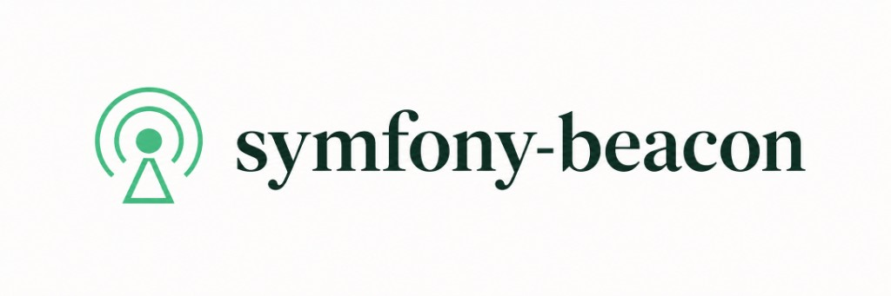

# Symfony Beacon — self-hosted error tracking for PHP & Symfony

<p align="center">
  <picture>
    <source media="(prefers-color-scheme: dark)" srcset="public/brand/logo-dark.jpg">
    
  </picture>
</p>

[](LICENSE)

Self-hosted error tracking focused on **PHP / Symfony**. Compatible with the **Envelope wire protocol**, so clients send events to this server via a project DSN — no SaaS account required.

Built on **Symfony 8.1**, **FrankenPHP** (classic/worker), **MySQL 9.7**, **Messenger**, **AuthKit**, **Vite + TypeScript + SCSS + Tailwind 4**, and **Spec-Driven Development** (GitHub Spec Kit).

> The Symfony instrumentation **bundle** is [`nowo-tech/beacon-bundle`](https://github.com/nowo-tech/BeaconBundle) (separate repository). Configure `BEACON_DSN` against this server (any host/port). Until Packagist publish, path-repo / VCS install works.


## Features

- Dashboard login with project-scoped memberships (`owner` / `admin` / `member`)
- **First-user registration** via [`nowo-tech/auth-kit-bundle`](https://packagist.org/packages/nowo-tech/auth-kit-bundle) (`registration_mode: first_user_only`)
- Login brute-force protection via [`nowo-tech/login-throttle-bundle`](https://packagist.org/packages/nowo-tech/login-throttle-bundle) (5 attempts / 15 minutes on AuthKit `main`)
- **i18n** auth routes (`/en/…`, `/es/…`), remember me, password toggle + strength on register, password history/expiry via [`nowo-tech/password-policy-bundle`](https://packagist.org/packages/nowo-tech/password-policy-bundle)
- Account enable/disable + online presence via [`nowo-tech/user-kit-bundle`](https://packagist.org/packages/nowo-tech/user-kit-bundle); audit timestamps/blame via [`nowo-tech/audit-kit-bundle`](https://packagist.org/packages/nowo-tech/audit-kit-bundle)
- Sensitive fields encrypted at rest via [`nowo-tech/doctrine-encrypt-bundle`](https://packagist.org/packages/nowo-tech/doctrine-encrypt-bundle) (API key secrets, notification webhook URLs)
- Declarative Doctrine migrations via [`nowo-tech/migrations-kit-bundle`](https://packagist.org/packages/nowo-tech/migrations-kit-bundle) (MDK + `migrations/FieldDictionary/`)
- Account Display collapsed-panel prefs via [`nowo-tech/tag-input-bundle`](https://packagist.org/packages/nowo-tech/tag-input-bundle) (Tagify)
- Projects with rotatable / revocable **API keys** and Envelope-compatible **DSN** (human-friendly key names in Settings)
- Project **Settings**: API keys, members, **governance** (retention / rate / daily quota), **notification destinations** (Slack / Discord / Teams / Telegram / email / HTTP; quiet hours + digests), **health** (Messenger + last delivery), and danger zone (clear history, **transfer ownership**, delete)
- Issue list with filters (level, status, environment, **release**, assignee, tag, URL, user), **priority**, similarity fingerprint, SQL-backed 24h / 7d / 30d windows, **saved views**, **CSV/JSON export**, and a **DataTables** responsive table (server-side sort + page in the URL)
- Issue detail: structured layout, collapsible panels, stack source context + copy path, breadcrumbs, request/tags/contexts, **assignee**, **priority**, **comments**, **mark duplicate** (optional event merge), **resolve/reopen/ignore**, and **assignment & status history**
- `POST /api/{project_id}/envelope/` ingest (Envelope auth header / query / envelope `dsn`); per-project suspend + daily quota
- Fast ACK + async processing (Messenger); Docker clients can ingest over HTTP `:9081` (`host.docker.internal`)
- Daily **analytics** at `/projects/{uuid}/analytics`: Chart.js series, period presets / custom UTC range, env/release/level filters, plus zero-filled daily table (`025-analytics-charts`); see [ROADMAP](docs/ROADMAP.md) Phase 5 for threshold alerts, release health, and related backlog
- Project notifications (Slack, Discord, Teams, Telegram, email, generic HTTP JSON) including **lifecycle** categories — setup guides in Settings and [docs/NOTIFICATIONS.md](docs/NOTIFICATIONS.md)
- Retention purge, ingest rate limits, `/health/live` + `/health/ready`
- Performance transactions/spans with **N+1** detection (`/projects/{uuid}/performance`, filter `?nplus1=1`)
- Main nav via [`nowo-tech/dashboard-menu-bundle`](https://packagist.org/packages/nowo-tech/dashboard-menu-bundle) (admin at `/admin/menus`, Beacon shell layout)
- Breadcrumbs via [`nowo-tech/breadcrumb-kit-bundle`](https://packagist.org/packages/nowo-tech/breadcrumb-kit-bundle) (admin at `/breadcrumb-kit-admin`, Beacon shell layout)
- Forms via [`nowo-tech/form-kit-bundle`](https://packagist.org/packages/nowo-tech/form-kit-bundle) (Tailwind / Beacon theme)
- Progressive Web App via [`nowo-tech/pwa-bundle`](https://packagist.org/packages/nowo-tech/pwa-bundle) (manifest, service worker, install prompt)
- **Appearance** settings for `ROLE_ADMIN` (brand name + accent colors) at `/settings/appearance`
- Public **legal** pages + GDPR cookie consent via [`nowo-tech/cookie-consent-bundle`](https://packagist.org/packages/nowo-tech/cookie-consent-bundle) — see [docs/LEGAL-AND-COOKIES.md](docs/LEGAL-AND-COOKIES.md)
- App shell: avatar switches among Preferences / Dashboard / Administration; each area has its own sidebar menu
- Account preferences at `/account/profile`, `/account/security`, `/account/display` (including default collapsed issue panels)
- Admin hub at `/admin` for `ROLE_ADMIN` (users, groups, **projects** with ops stats / suspend ingest / view-as-member, appearance, menus, breadcrumbs); unlink projects from users (Activity) and groups (group detail)

Membership roles today: **owner** / **admin** / **member** (no viewer yet — see roadmap `026-magic-links-viewer`). Auth is password (+ remember-me); magic login links are planned (`026`), SSO is Later.

## Requirements

- Docker + Docker Compose
- Canonical stack: PHP 8.5 via `dunglas/frankenphp:1-php8.5`, Symfony 8.1.*

## Quick start

```bash
git clone https://github.com/nowo-tech/symfony-beacon.git
cd symfony-beacon
cp .env.dist .env
make up          # starts stack + builds frontend into public/build/
make bootstrap   # migrate + seed demo user/project + write .demo-client.env
# Optional live CSS/JS reload: make vite-hmr  (stop it + make vite-build when done)
# Option A — register the first admin in the UI: https://localhost:9444/en/register
# Option B — seed only (if migrate already done): make seed
```

- HTTP: http://localhost:9081  
- HTTPS: https://localhost:9444  
- MySQL: `localhost:3308`
- Demo login (after seed): `admin@symfony-beacon.local` / `admin123`
- After seed, open Performance with N+1 filter: `/projects/1/performance?nplus1=1` (transaction `demo.nplus1.products`)
- After seed, open Analytics: `/projects/1/analytics` (14 days of error / transaction / N+1 counters)
- First-user registration (empty DB only): https://localhost:9444/en/register (Spanish: `/es/register`)
- Login: https://localhost:9444/en/login (includes **Remember me**)

> After the first user exists, `/en/register` redirects to `/en/login`. Auth routes use `/{_locale}` (`en` default). Bare `/`, `/login`, `/register`, and `/logout` redirect to the English AuthKit paths. After sign-in, the app home is **`/dashboard`**.

Seed prints DSNs and writes `.demo-client.env` for the [BeaconBundle](https://github.com/nowo-tech/BeaconBundle) FrankenPHP demo:

```text
UI DSN: https://<public_key>@localhost:9444/<project_id>
Client DSN (Docker): http://<public_key>@host.docker.internal:9081/<project_id>
```

In `BeaconBundle/demo/symfony8`, `make up` / `make sync-beacon` copies that Client DSN into `BEACON_DSN` so `/exception` can ingest directly.

## FrankenPHP worker

```bash
make worker   # FRANKENPHP_MODE=worker
make classic  # per-request boot
```

Application code is written for worker safety (`ResetInterface` when needed). See [docs/FRANKENPHP-CODING.md](docs/FRANKENPHP-CODING.md).

## Architecture

Modular Symfony (not full DDD). **Why this shape** and **Mermaid flows:** [docs/ARCHITECTURE.md](docs/ARCHITECTURE.md).

| Module | Responsibility |
|--------|----------------|
| `Identity` | Users (AuthKit login/register), account prefs, seed command |
| `Project` | Projects, API keys, memberships, Settings / danger zone (clear, transfer ownership, delete) |
| `Ingest` | Envelope API + async pipeline |
| `Issues` | Grouping, list/filter, assignee, status + history, event detail |
| `Performance` | Transactions, spans, N+1 |
| `Analytics` | Daily aggregates + charts/filters (`025`); table + Chart.js |
| `Notifications` | Slack / Discord / Teams / Telegram / email / HTTP destinations |
| `Shared` | Appearance, menus/breadcrumbs glue, legal pages |

## Spec-Driven Development

Specs live under `specs/`. Constitution: `.specify/memory/constitution.md`.

## Tests

```bash
make test
# or
docker compose exec php php bin/phpunit
```

## Documentation

- [Architecture rationale](docs/ARCHITECTURE.md)
- [Product roadmap](docs/ROADMAP.md)
- [Project notifications](docs/NOTIFICATIONS.md)
- [Changelog](docs/CHANGELOG.md)
- [Upgrading](docs/UPGRADING.md)
- [Release checklist](docs/RELEASE.md)
- [Security policy](SECURITY.md)
- [DSN / SDK](docs/DSN.md)
- [Event context (timestamps, versions, user)](docs/EVENT-CONTEXT.md)
- [Mobile / PWA (Hotwire Native removed)](docs/NATIVE-MOBILE.md)
- [Legal pages & cookie consent](docs/LEGAL-AND-COOKIES.md)
- [Production](docs/PRODUCTION.md)
- [Contributing](docs/CONTRIBUTING.md)

## License

MIT — see [LICENSE](LICENSE).
