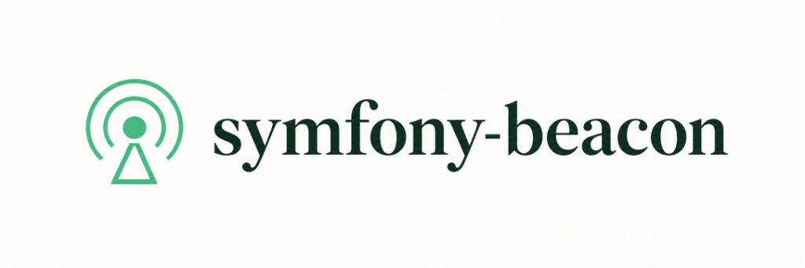

# Symfony Beacon — self-hosted error tracking for PHP & Symfony

<p align="center">
  <picture>
    <source media="(prefers-color-scheme: dark)" srcset="public/brand/logo-dark.jpg">
    
  </picture>
</p>

[](https://github.com/nowo-tech/symfony-beacon/actions/workflows/ci.yml)
[](https://github.com/nowo-tech/symfony-beacon/releases)
[](https://github.com/nowo-tech/symfony-beacon/releases)
[](LICENSE)
[](https://php.net)
[](https://symfony.com)
[](https://github.com/nowo-tech/symfony-beacon)
[](#tests-and-coverage)

> ⭐ **Found this useful?** Give the repo a **star** on [GitHub](https://github.com/nowo-tech/symfony-beacon) so more operators can find it. Client SDK: [`nowo-tech/beacon-bundle`](https://packagist.org/packages/nowo-tech/beacon-bundle).

Self-hosted error tracking focused on **PHP / Symfony**. Compatible with the **Envelope wire protocol**, so clients send events to this server via a project DSN — no SaaS account required.

Built on **Symfony 8.1**, **PHP 8.5**, **FrankenPHP** (classic/worker), **MySQL 9.7**, **Messenger**, **AuthKit**, **Vite + TypeScript + SCSS + Tailwind 4**, and **Spec-Driven Development** (GitHub Spec Kit).


This application is **FrankenPHP worker mode friendly**.

> The Symfony instrumentation **bundle** is [`nowo-tech/beacon-bundle`](https://github.com/nowo-tech/BeaconBundle) (separate repository). This server **also** requires that bundle so the instance can dogfood its own errors when `BEACON_DSN` is set (see [DSN.md](docs/DSN.md)). External apps still point their DSN at this server.


## Features

- Dashboard login with project-scoped memberships (`owner` / `admin` / `member` / `viewer`)
- Password or **magic login** / **password reset** via AuthKit (`/login/magic`, `/reset-password`) — only when Administration → Mailer has a deliverable encrypted DSN; project **share links** for time-limited viewer access (project-wide or issue-scoped)
- **First-user registration** via [`nowo-tech/auth-kit-bundle`](https://packagist.org/packages/nowo-tech/auth-kit-bundle) (`registration_mode: first_user_only`)
- Login brute-force protection via [`nowo-tech/login-throttle-bundle`](https://packagist.org/packages/nowo-tech/login-throttle-bundle) (5 attempts / 15 minutes on AuthKit `main`)
- **i18n** UI locales: `en`, `es`, `de`, `nl`, `fr`, `it`, `pt`; AuthKit dual URLs (bare for `DEFAULT_LOCALE`, prefixed for others — see [ADDING-LOCALES.md](docs/dev/ADDING-LOCALES.md)); remember me; password toggle + strength; password history/expiry via [`nowo-tech/password-policy-bundle`](https://packagist.org/packages/nowo-tech/password-policy-bundle)
- Account enable/disable + online presence via [`nowo-tech/user-kit-bundle`](https://packagist.org/packages/nowo-tech/user-kit-bundle); audit timestamps/blame via [`nowo-tech/audit-kit-bundle`](https://packagist.org/packages/nowo-tech/audit-kit-bundle)
- Sensitive fields encrypted at rest via [`nowo-tech/doctrine-encrypt-bundle`](https://packagist.org/packages/nowo-tech/doctrine-encrypt-bundle) (API key secrets, notification webhook URLs, push subscriptions, **instance Mailer DSN/From**, **Mercure URL/JWT**)
- **Administration → Mailer** (`/admin/mailer`): encrypted Symfony Mailer DSN + From; **Send sample email**; gates magic login — local catcher: `make mailpit` ([docs/ops/MAILPIT.md](docs/ops/MAILPIT.md))
- **Administration → Mercure** (`/admin/mercure`): optional live member-issue toasts (hub + JWT); preference-filtered per user — see [docs/ops/MERCURE.md](docs/ops/MERCURE.md)
- Declarative Doctrine migrations via [`nowo-tech/migrations-kit-bundle`](https://packagist.org/packages/nowo-tech/migrations-kit-bundle) (MDK + `migrations/FieldDictionary/`)
- Account Display: theme, density, motion, font scale, contrast, sidebar, collapsed-panel prefs via [`nowo-tech/tag-input-bundle`](https://packagist.org/packages/nowo-tech/tag-input-bundle) (Tagify); **product tours** (Select all); **member alert matrix** (Mercure + Web Push events/scope/projects) + optional **browser Web Push** device opt-in; PWA install
- Install seed layers + **SiteBackup** setup wizard (`/setup`; auto-redirect when catalogs/schema need bootstrap); ops panel `/_site_backup`; contextual **product tour** (driver.js) on first dashboard / project Issues / admin visit
- Projects with rotatable / revocable **API keys** and Envelope-compatible **DSN** (human-friendly key names in Settings)
- Project **Settings**: API keys, members, **governance** (retention / rate / daily quota), **notification destinations** (Slack / Discord / Teams / Telegram / email / HTTP; quiet hours + digests + thresholds), **health** (Messenger + delivery history), and danger zone (clear history, **transfer ownership**, delete)
- Issue list with filters (level, status, environment, **release**, assignee, tag, URL, user), **priority**, similarity fingerprint, SQL-backed 24h / 7d / 30d windows, **FULLTEXT** search, **saved views**, **CSV/JSON export**, and a **DataTables** responsive table (server-side sort + page in the URL)
- Issue detail: structured layout, collapsible panels, stack source context + copy path, breadcrumbs, request/tags/contexts, **Copy for AI** (`beacon-ai-export/v1` Markdown/JSON — [docs/product/AI-EXPORT.md](docs/product/AI-EXPORT.md)), **assignee**, **priority**, **comments**, **mark duplicate** (optional event merge), **resolve/reopen/ignore**, and **assignment & status history**
- `POST /api/{project_id}/envelope/` ingest (`X-Beacon-Auth` / envelope `dsn`; query auth **deprecated**); per-project suspend + daily quota; secret always required
- **OTLP HTTP JSON** adapters: `POST /api/{project_id}/otlp/v1/logs|traces|metrics` (WARN+ logs, ERROR spans, failure-like metric data points → Issues; same DSN auth)
- Fast ACK + async processing (Messenger); Docker clients can ingest over HTTP `:9084` (`host.docker.internal`)
- Daily **analytics** at `/projects/{uuid}/analytics`: Chart.js series, period presets / custom UTC range, env/release/level filters, plus zero-filled daily table (`025-analytics-charts`)
- **Release health** at `/projects/{uuid}/releases` (new-in-release counts + compare)
- Operator **OpenAPI** panel at `/admin/api/doc` (Nelmio) — see [docs/API.md](docs/API.md)
- Phase 5+ product depth: **threshold alerts**, **delivery history**, admin **project audit**, **encrypted Mailer**, **Prometheus** `/metrics`, **notification circuit breaker**, **GDPR account export/anonymize**, **CI coverage** report — see [ROADMAP](docs/ROADMAP.md) (SSO Later)
- Project notifications (Slack, Discord, Teams, Telegram, email, generic HTTP JSON) including **lifecycle** categories, Slack/Teams **Resolve** / **Assign**, and channel-native **Send test** — [docs/product/NOTIFICATIONS.md](docs/product/NOTIFICATIONS.md)
- Optional **inbound email** replies → issue comments — [docs/product/INBOUND-EMAIL.md](docs/product/INBOUND-EMAIL.md)
- **QR phone login** (AuthKit + image via `endroid/qr-code`); SMS OTP Later — pluggable **SMS Bridge** provider ready ([docs/product/SMS.md](docs/product/SMS.md))
- Retention purge, ingest rate limits, `/health/live` + `/health/ready`
- Performance transactions/spans with **N+1** detection (`/projects/{uuid}/performance`, filter `?nplus1=1`)
- Main nav via [`nowo-tech/dashboard-menu-bundle`](https://packagist.org/packages/nowo-tech/dashboard-menu-bundle) (admin at `/admin/menus`, Beacon shell layout)
- Breadcrumbs via [`nowo-tech/breadcrumb-kit-bundle`](https://packagist.org/packages/nowo-tech/breadcrumb-kit-bundle) (admin at `/breadcrumb-kit-admin`, Beacon shell layout)
- Admin UI chrome via [`nowo-tech/ui-kit-bundle`](https://packagist.org/packages/nowo-tech/ui-kit-bundle) (`css_framework: tailwind`, Beacon `--nowo-ui-*` remap under `.kit-admin`)
- Forms via [`nowo-tech/form-kit-bundle`](https://packagist.org/packages/nowo-tech/form-kit-bundle) (Tailwind / Beacon theme + kit profiles)
- Progressive Web App via [`nowo-tech/pwa-bundle`](https://packagist.org/packages/nowo-tech/pwa-bundle) (manifest, service worker, install prompt); **optional** member alerts (new / regression / resolve / reopen / assign / comment) — Mercure live toasts via **Administration → Mercure** ([docs/ops/MERCURE.md](docs/ops/MERCURE.md)), prefs + Web Push via **Account → Display → Notifications** ([docs/product/NOTIFICATIONS.md](docs/product/NOTIFICATIONS.md))
- Brand: beacon mark + wordmarks under `public/brand/`; UI typeface **Montserrat**
- **Appearance** settings for `ROLE_ADMIN` (named light/dark theme presets, brand, layout, colors) at `/admin/appearance` (`082`)
- Public **legal** pages + GDPR cookie consent via [`nowo-tech/cookie-consent-bundle`](https://packagist.org/packages/nowo-tech/cookie-consent-bundle) — see [docs/product/LEGAL-AND-COOKIES.md](docs/product/LEGAL-AND-COOKIES.md)
- App shell: avatar switches among Preferences / Dashboard / Administration; each area has its own sidebar menu
- Account preferences at `/account/profile`, `/account/security`, `/account/display`
- Admin hub at `/admin` for `ROLE_ADMIN` (users, groups, **projects** with ops stats / suspend ingest / view-as-member, Mailer, Mercure, appearance, menus, breadcrumbs); unlink projects from users (Activity) and groups (group detail)

Membership roles: **owner** / **admin** / **member** / **viewer** (read-only). Instance Security roles: **`ROLE_USER`** (any signed-in account) and **`ROLE_ADMIN`** (Administration) — see [docs/product/ROLES.md](docs/product/ROLES.md). Auth is password (+ remember-me) or **magic login** (`/login/magic`); SSO is Later.

## Requirements

- Docker + Docker Compose
- Canonical stack: PHP 8.5 via `dunglas/frankenphp:1-php8.5`, Symfony 8.1.*

## Quick start

```bash
git clone https://github.com/nowo-tech/symfony-beacon.git
cd symfony-beacon
cp .env.dist .env.local
make up          # shared infra (MySQL/Redis) + app + builds frontend into public/build/
make ready       # migrate + platform + demo admin/project + dogfood BEACON_DSN
# or: make bootstrap && make seed
# Optional QA samples: make seed-sample
# Optional local SMTP: make mailpit  (UI http://localhost:18026 — docs/ops/MAILPIT.md)
# Option A — register the first admin in the UI: https://localhost:9447/en/register
# Option B — demo login after make ready / make seed (see below)
```

**Shared infra** (MySQL + Redis on `server_network`, reusable by sibling projects — see [docs/ops/SHARED-SERVER.md](docs/ops/SHARED-SERVER.md)):

```bash
make up-infra                 # MYSQL_TOPOLOGY=simple|replica
# or coexist with developer.local.server/server (same container names)
make up                       # app joins the shared network
make ready
```

- HTTP: http://localhost:9084  
- HTTPS: https://localhost:9447  
- MySQL: `mysql-9.7-primary` on the shared network (no host port; `make mysql`)
- Mailpit (after `make mailpit`): http://localhost:18026 — save `smtp://mailpit:1025` (shared) or `smtp://mailer:1025` (app-local) in Administration → Mailer
- Demo login (after seed): `admin@symfony-beacon.local` / `admin123`
- Browser E2E (Playwright): `make test-e2e` — see [`e2e/README.md`](e2e/README.md)
- After seed, open Performance with N+1 filter: `/projects/{uuid}/performance?nplus1=1` (transaction `demo.nplus1.products`)
- After seed, open Analytics: `/projects/{uuid}/analytics` (14 days of error / transaction / N+1 counters)
- First-user registration (empty DB only): https://localhost:9447/register
- Login: https://localhost:9447/login (serves `DEFAULT_LOCALE`; other languages via `/en/login`, …; **Remember me**; header language switcher)
- OpenAPI (after login, admin): https://localhost:9447/admin/api/doc

> After the first user exists, `/register` redirects to login. AuthKit: bare paths for `DEFAULT_LOCALE`, prefixed for other locales. First-run / cold DB uses SiteBackup at `/setup` (panel `/_site_backup`). Legal bare paths redirect to `/{DEFAULT_LOCALE}/legal/…`. **`.env.dist` ships `DEFAULT_LOCALE=en`; this project's `.env` uses `es`.** After sign-in the app home is **`/dashboard`** with language from the account preference (no `_locale` in dashboard URLs). Complete setup/first register **before** publishing the port — the first registrant is `ROLE_ADMIN`.

Seed prints DSNs and writes `.demo-client.env` (mode **600**) for the [BeaconBundle](https://github.com/nowo-tech/BeaconBundle) FrankenPHP demo:

```text
UI DSN: https://<public_key>:<secret>@localhost:9447/<project_id>
Client DSN (Docker): http://<public_key>:<secret>@host.docker.internal:9084/<project_id>
Self DSN (dogfood): http://<public_key>:<secret>@127.0.0.1/<project_id>
```

In `BeaconBundle/demo/symfony8`, `make up` / `make sync-beacon` copies that Client DSN into `BEACON_DSN` so `/exception` can ingest directly.

## FrankenPHP worker

```bash
make worker   # FRANKENPHP_MODE=worker
make classic  # per-request boot
```

Application code is written for worker safety (`ResetInterface` when needed). See [docs/ops/FRANKENPHP-CODING.md](docs/ops/FRANKENPHP-CODING.md). Local **hot reload** (Twig/PHP → browser): [docs/ops/FRANKENPHP-HOT-RELOAD.md](docs/ops/FRANKENPHP-HOT-RELOAD.md).

## Architecture

Modular Symfony (not full DDD). **Why this shape** and **Mermaid flows:** [docs/ARCHITECTURE.md](docs/ARCHITECTURE.md). **Tables / ER diagrams:** [docs/dev/DATABASE.md](docs/dev/DATABASE.md).

| Module | Responsibility |
|--------|----------------|
| `Identity` | Users (AuthKit login/register), account prefs, magic login, seed command |
| `Project` | Projects, API keys, memberships (`viewer` + share links), Settings / danger zone / admin project ops |
| `Ingest` | Envelope API + OTLP adapters + async pipeline |
| `Issues` | Grouping, list/filter, FULLTEXT, assignee, status + history, event detail |
| `Performance` | Transactions, spans, N+1 |
| `Analytics` | Daily aggregates + charts/filters (`025`); table + Chart.js |
| `Notifications` | Slack / Discord / Teams / Telegram / email / HTTP; digests, thresholds, delivery history |
| `Ops` | Instance ops overview, retention purge, Prometheus metrics collector |
| `Setup` | Platform / sample seed commands + demo fixtures |
| `Api` | Read API (Bearer project tokens) |
| `Shared` | Appearance, menus/breadcrumbs glue, legal pages, instance Mailer / Mercure |

## Spec-Driven Development

Specs live under `specs/`. Constitution: `.specify/memory/constitution.md`.

## Tests and coverage

```bash
make test
# Suites: Unit | Functional | Integration
make test ARGS='--testsuite Unit'
# or
docker compose exec php vendor/bin/phpunit

# HTML + Clover report (Xdebug in Compose); optional soft gate:
make test-coverage
# COVERAGE_MIN=40 make test-coverage

# Frontend unit (Vitest + jsdom in the php container):
make test-unit-js
make test-unit-js-coverage   # → var/coverage-js/

# Browser E2E (after make up + make seed):
make test-e2e
```

Layout: `tests/Unit/` (pure `TestCase`), `tests/Functional/` (HTTP), `tests/Integration/` (kernel/DB/commands), helpers in `tests/Support/`. Frontend unit specs: `assets/**/*.test.ts` (`vitest.config.ts`).

CI runs PHPUnit on every push/PR and a separate **Coverage** job (PCOV) that uploads Clover/HTML artifacts. Soft gate defaults to `COVERAGE_MIN=35` in CI (never 100%). See [docs/CONTRIBUTING.md](docs/CONTRIBUTING.md) and `specs/033-coverage-ci/`.

| Suite | Notes |
|-------|--------|
| PHP | PHPUnit (`make test` / CI) — Unit / Functional / Integration |
| Coverage | `make test-coverage` / CI Coverage job |
| Frontend unit | Vitest (`make test-unit-js`) — Stimulus + libs |
| E2E | Playwright (`make test-e2e` / CI) |
| Build | Vite build in CI Docker job |

## Documentation

Index: **[docs/README.md](docs/README.md)** (canonical manuals + categorized guides).

- [Install & seed layers](docs/INSTALL.md)
- [Architecture rationale](docs/ARCHITECTURE.md)
- [Database schema (Mermaid ER)](docs/dev/DATABASE.md)
- [HTTP API overview](docs/API.md)
- [Product roadmap](docs/ROADMAP.md)
- [Project notifications](docs/product/NOTIFICATIONS.md)
- [Inbound email comments](docs/product/INBOUND-EMAIL.md)
- [Mercure (live alerts, JWT)](docs/ops/MERCURE.md)
- [Mailpit (local SMTP catcher)](docs/ops/MAILPIT.md)
- [Changelog](docs/CHANGELOG.md)
- [Upgrading](docs/UPGRADING.md)
- [Release checklist](docs/RELEASE.md)
- [Security policy](SECURITY.md)
- [DSN / SDK](docs/DSN.md)
- [Event context (timestamps, versions, user)](docs/product/EVENT-CONTEXT.md)
- [Mobile / PWA](docs/dev/NATIVE-MOBILE.md)
- [Legal pages & cookie consent](docs/product/LEGAL-AND-COOKIES.md)
- [Adding a UI language](docs/dev/ADDING-LOCALES.md)
- [Production](docs/PRODUCTION.md)
- [FrankenPHP coding (worker safety)](docs/ops/FRANKENPHP-CODING.md)
- [Contributing](docs/CONTRIBUTING.md)
- [Funding](docs/dev/FUNDING.md)

## License

MIT — see [LICENSE](LICENSE).
