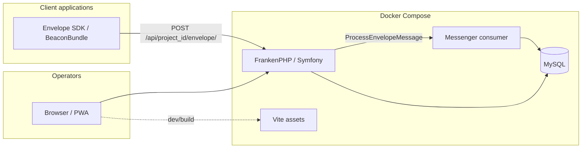
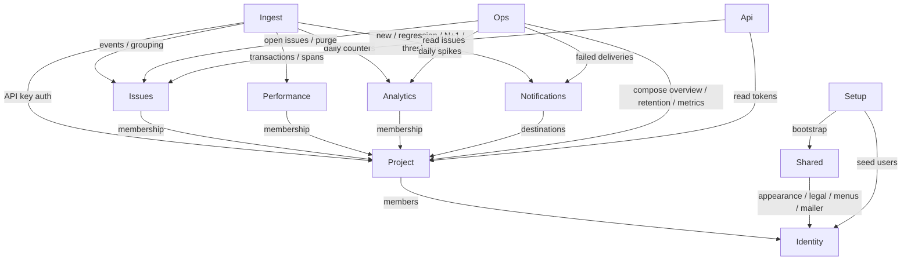
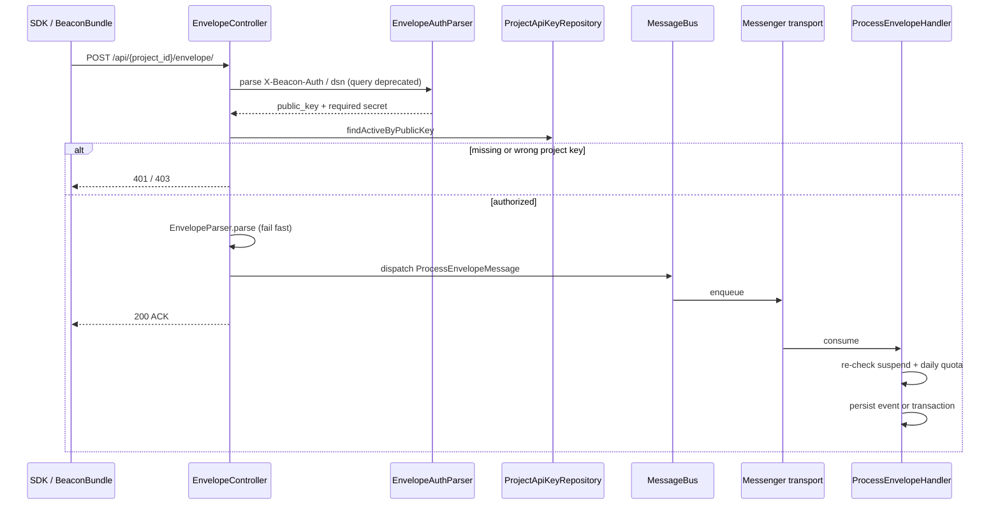
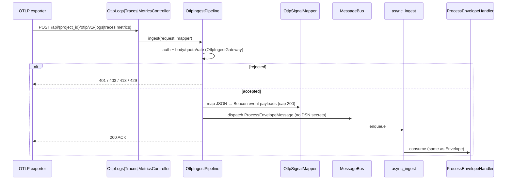
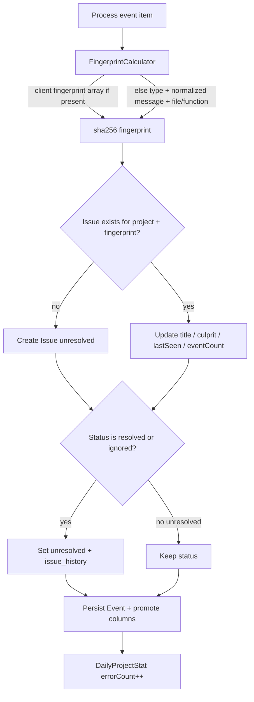
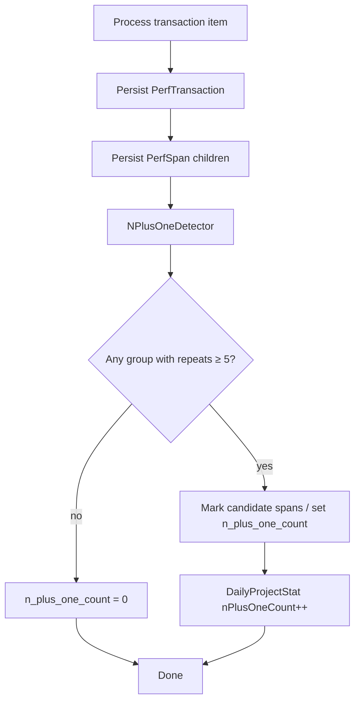
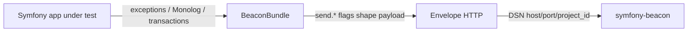

# Architecture rationale

This document explains **why** Symfony Beacon uses its current shape: modular Symfony packages, FrankenPHP, Envelope-compatible ingest, Messenger, Twig + Vite, and Nowo.tech kits — instead of a full DDD/hexagonal rewrite, a separate SPA, or a classic Nginx+FPM stack.

Normative constraints live in [`.specify/memory/constitution.md`](../.specify/memory/constitution.md). Coding rules for the HTTP runtime are in [FRANKENPHP-CODING.md](ops/FRANKENPHP-CODING.md).

## Product constraints that drive the design

Beacon is a **self-hosted error-tracking server** for PHP/Symfony operators. It must:

1. Accept telemetry that existing SDKs already know how to send (**Envelope wire protocol**).
2. Acknowledge ingest **quickly** under bursty error traffic.
3. Offer a usable operator UI (browser and installable PWA) without requiring a SaaS account.
4. Stay operable by a small team: Docker-first, Spec-Driven Development, English docs.

Those constraints favour a familiar Symfony modular app over an academic layered architecture.

## Why modular Symfony (not full DDD / hexagonal)

| Choice | Rationale |
|--------|-----------|
| Packages under `src/{Identity,Project,Ingest,…}` | Boundaries follow **product capabilities** (ingest vs issues vs performance), which match how features are specified and released. |
| Controllers + Doctrine entities + focused services | Matches Symfony Flex conventions contributors already know; less ceremony than ports/adapters for a single deployable app. |
| Explicit “no full DDD/hexagonal” | Hexagonal layers pay off when many adapters or bounded contexts compete. Beacon has one primary write path (Envelope → Messenger → persistence) and one primary read path (Twig UI). Extra layers would slow Spec Kit delivery without clear gain. |

Modules stay **thin and directional**: Ingest writes Issues/Performance/Analytics; UI modules read them. **Ops** owns instance overview, retention purge, and **metrics scrape/collection** (`App\Ops\Metrics`). **Setup** owns platform/sample seeders and demo fixtures. Shared holds cross-cutting UI glue (appearance, legal, menus, settings entity traits), not a generic “domain kernel”. Domain enums live in the owning module (`Issues\Enum`, `Project\Enum`). Identity admin flows that mutate project memberships go through **`ProjectMembershipAdminPort`** (not `ProjectMembershipManager` directly). Project-scoped HTTP prefers **`#[IsGranted(ProjectPermission::…, 'project')]`** via `ProjectPermissionVoter`; `InstancePermissionVoter` **abstains** when the subject is a `Project` so instance `ROLE_PROJECT_*` cannot bypass membership under the affirmative strategy. `ProjectAccessService` remains for share-link nuance and non-HTTP paths. Membership/group mutations share **`ProjectMembershipPolicy`** / **`ProjectGroupAccessManager`**.

## Why FrankenPHP + Docker (not Nginx+FPM on the host)

| Choice | Rationale |
|--------|-----------|
| `dunglas/frankenphp` image | One container serves HTTP (Caddy) and PHP; fewer moving parts for self-hosters. |
| Classic **or** worker via `FRANKENPHP_MODE` | Operators can trade isolation for throughput without forking the codebase. Application code targets **worker-safe** behaviour so both modes remain valid. |
| Docker Compose as the required local env | Reproducible MySQL, Messenger consumer, Vite, and Caddy ports; no “works on my host PHP” drift. |

See [PRODUCTION.md](PRODUCTION.md) for the optional baked prod image target.

## Why fast ACK + Symfony Messenger

Ingest is the hot path. The constitution requires Envelope endpoints to **authenticate and acknowledge quickly**, then process asynchronously.

| Choice | Rationale |
|--------|-----------|
| `POST /api/{project_id}/envelope/` | Envelope-compatible URL shape; SDKs and `nowo-tech/beacon-bundle` can point a DSN at any host/port. |
| Auth via `X-Beacon-Auth` and/or envelope `dsn` (query string **removed**) | Wire compatibility with Envelope clients; mapped to project API keys (`secret_hash` at rest). See [DSN.md](DSN.md). |
| Messenger (`ProcessEnvelopeMessage` → `async_ingest`) | Grouping, fingerprinting, N+1 detection, and daily stats are CPU/DB heavy — they must not block the ACK. Notifications / HTTP-log use a separate `async` queue so outbound backlog does not starve ingest (`083`). |
| Separate `messenger` + `messenger-notify` Compose services | `messenger` consumes `async_ingest` only; `messenger-notify` consumes `async` (notifications / HTTP-log / Web Push) so outbound backlog cannot starve ingest (`085`). |
| Worker re-check (`051`) | After ACK, the consumer re-validates ingest suspend + daily quota before persisting. |

## Why Twig + Vite/Stimulus (not a separate SPA)

| Choice | Rationale |
|--------|-----------|
| Server-rendered Twig | Auth, CSRF, flash messages, and permission checks stay in one stack; good fit for an operator console. |
| Stimulus | Progressive enhancement for interactive widgets (DataTables, clipboard, collapse panels). |
| Vite + TypeScript + Tailwind 4 | Modern asset pipeline without splitting the product into “API repo + frontend repo”. |
| PWA | Same Twig app is installable via `nowo-tech/pwa-bundle` (see [NATIVE-MOBILE.md](dev/NATIVE-MOBILE.md); Hotwire Native is Later on the roadmap). |
| Montserrat | Brand wordmarks and app chrome share one geometric sans (self-hosted). |

A dedicated SPA would force a second auth model, duplicated validation, and larger ops surface for little benefit on CRUD-heavy admin screens.

## Why Nowo.tech kits over hand-rolled auth/legal UX

Login, registration, cookies, menus, and forms are solved problems. Preferring [`nowo-tech/*`](https://packagist.org/packages/nowo-tech/) kits:

- Keeps Beacon focused on **telemetry** (ingest, grouping, performance, analytics).
- Reuses tested AuthKit / UserKit / AuditKit / cookie-consent / dashboard-menu / form-kit behaviour.
- Leaves room for operator legal pages without inventing a consent stack ([LEGAL-AND-COOKIES.md](product/LEGAL-AND-COOKIES.md)).

Identity in this repo owns **User** persistence, account preferences, magic-login gating, and project membership; AuthKit owns the login/register chrome.

## Why Envelope compatibility (and a separate BeaconBundle)

| Choice | Rationale |
|--------|-----------|
| Envelope protocol on the server | Operators can point Envelope-compatible clients (especially `nowo-tech/beacon-bundle`) at this server immediately. |
| `nowo-tech/beacon-bundle` in another repository | Client instrumentation evolves independently. This server may still **require** the bundle to dogfood its own errors (`BEACON_DSN` → loopback demo project after `make ready` / `make dogfood`; auto `reload-env` when file DSN ≠ container). Operators verify with `make beacon-test` (ACK) or `make beacon-suite` (multi-event UI probe — spec `058`). External apps keep using a separate install. |

Promoted event columns (environment, release, PHP/Symfony versions, …) exist for **UI and filters**; full JSON in `event.payload` remains the source of truth ([EVENT-CONTEXT.md](product/EVENT-CONTEXT.md)).

## Why Spec-Driven Development

Features are specified under `specs/` before large changes. That matches an open-source product where:

- Acceptance criteria must stay reviewable without reading every PR.
- Architecture decisions (this doc + constitution) are amendable, not tribal knowledge.
- PHPUnit coverage is tied to scenarios in each feature spec. Suites live under `tests/Unit/`, `tests/Functional/`, and `tests/Integration/` (helpers in `tests/Support/`). Frontend unit tests use Vitest (`assets/**/*.test.ts`; `make test-unit-js`).

## Module map (as-built)

| Module | Responsibility | Why it is separate |
|--------|----------------|--------------------|
| `Identity` | Users, account prefs (`UserUiPreferences` embeddable), magic login (Mailer-gated), seed; instance `ROLE_USER` / `ROLE_ADMIN` | Auth boundary; AuthKit + Security `login_link` (`026`); see [ROLES.md](product/ROLES.md) |
| `Project` | Projects, keys, memberships (`owner`/`admin`/`member`/`viewer`), Settings / danger zone, share links; admin project ops (target owner per `083`); `ProjectFactory` / `ProjectApiKeyFactory` / `AccessibleProjectFilter` for create + list filters | Multi-tenant tenancy unit; membership roles ≠ Security `ROLE_*` |
| `Ingest` | Envelope HTTP + async pipeline; OTLP HTTP JSON adapters via `OtlpIngestPipeline` + `OtlpIngestGatewayInterface` + per-signal mappers (`logs` / `traces` / `metrics`) into the same Envelope worker | Latency-sensitive write path |
| `Issues` | Fingerprint grouping, list/detail, assignee, status UI, `issue_history`, FULLTEXT; shared `IssueJsonNormalizer` for export / read API | Primary debugging UX |
| `Performance` | Transactions, spans, N+1 | Distinct Envelope item type and UI |
| `Analytics` | Daily aggregates + period charts/filters (`025`) | Read models from `DailyProjectStat`; filtered errors from `Event` |
| `Notifications` | Slack / Discord / Teams / Telegram / email / HTTP; digests, thresholds, delivery history | Outbound alerts after ingest |
| `Shared` | Appearance, menus/breadcrumbs glue, legal, instance Mailer / Mercure / instance settings, health/metrics scrape chrome | Cross-cutting presentation / instance config — **not** domain write ownership (see `083` / `085`) |
| `Ops` | Admin ops overview, retention purge, Prometheus metrics collector | Instance ops that *compose* Project/Issues/Notifications/Analytics — not Shared |
| `Setup` | First-run / SiteBackup bootstrap; **platform & sample demo seeders** under `Setup\Demo` + JSON fixtures in `Setup\Demo/fixtures` + `app:seed-platform` / `app:seed-sample` | Cold-start and QA seed path — not day-to-day product UI |
| `Api` | Bearer read API for automation (`ProjectReadApiController`); IP rate-limited (`BEACON_READ_API_RATE_LIMIT`) | JSON read path separate from Twig UI and Envelope ingest |

Boundary hardening (`083` / `085`): Shared growth rules, `Ops` module, Envelope domain writers, Identity↔Project direction, Issues/Ingest maintainability, process-level async drain isolation. Internal DRY (`086` / **v1.3.1**+): thin OTLP controllers behind `OtlpIngestPipeline`, Project/Issue factories & normalizers (demo seed via `ProjectFactory`), shared Twig shells (`_confirm_dialog` with structured `header`/`content`/`actions` for form dialogs, careful `open_on_connect`, dark black modal scrim; admin `_list_page`; dashboard `_feed_layout`), host forms on FormKit. Security audit hardening (`087` / 6.36): API DSN gating for managers (create/rotate banner; active keys may list DSN; revoked keys redacted — amended 2026-08-11), seed/APP_SECRET fail-closed, metrics require-token default, tighten-only config import. Instance RBAC catalog + i18n: `docs/product/ROLES.md` / `002` FR-012.

Entity tables, columns, and FK relationships (Mermaid ER): [DATABASE.md](dev/DATABASE.md).

## Flows (Mermaid)

The diagrams below describe the **as-built** runtime paths. They complement the rationale above; implementation details live under `src/` and the feature specs.

### System context

How operators, client apps, and Compose services relate to Beacon.



### Module dependencies

Write path vs read path. Arrows mean “uses / writes into”.



> Solid arrows: primary runtime dependencies. `Ops` *composes* Project/Issues/Notifications/Analytics for overview / retention / metrics — Shared must not own those paths (`085`).

### Envelope ingest (fast ACK)

HTTP request authenticates, validates parseability, dispatches Messenger, and returns. Heavy work is **not** on the request thread.



### OTLP HTTP JSON → Envelope worker

Logs, traces, and metrics share one pipeline: authenticate and apply Ops limits via the gateway, map with a signal-specific mapper, then dispatch the same `ProcessEnvelopeMessage` path as Envelope ingest. Controllers stay thin (`086`).



### Event item → issue grouping

After dequeue, event items update (or create) an `Issue` by fingerprint, store `Event`, and bump daily error stats. Matching events reopen **resolved** and **ignored** issues to **unresolved** and append a system row to `issue_history`.



### Transaction item → N+1

Transaction envelopes create `PerfTransaction` / `PerfSpan` rows and run `NPlusOneDetector` (≥5 similar db-like spans).



### Operator UI access

Session login (AuthKit) then project-scoped membership checks on every project page. Share links grant time-limited **viewer** access (project-wide or issue-scoped).

```mermaid
flowchart TD
  Anon[Anonymous request] --> Gate{Authenticated?}
  Gate -->|no| Share{Valid share token?}
  Share -->|yes| Viewer[Viewer session]
  Share -->|no| Login[AuthKit /login]
  Login --> Dash[/dashboard]
  Gate -->|yes| Dash
  Viewer --> IssueOrProject[Issue show or project pages per grant]
  Dash --> Pick[Open project]
  Pick --> Home[Redirect to Issues]
  Home --> Access[ProjectAccessService]
  Access -->|owner/admin/member/viewer| UI[Issues / Performance / Analytics / Settings]
  Access -->|not a member| Deny[403]
  UI --> Role{Action needs elevated role?}
  Role -->|clear history: owner/admin| OK1[Allowed]
  Role -->|delete project: owner| OK2[Allowed]
  Role -->|insufficient| Deny
```

### Client instrumentation → Beacon

Server and client repos stay decoupled; DSN points at this host.



## Deliberate non-goals

- **Not** a multi-region SaaS control plane.
- **Not** a generic observability backend (metrics/logs/traces as first-class products).
- **Not** a mobile-only API + React Native / Hotwire Native client in this repository.
- **Not** replacing Envelope with a proprietary ingest protocol.

When a change would violate these non-goals or the constitution stack, amend the constitution and add a feature spec first.
