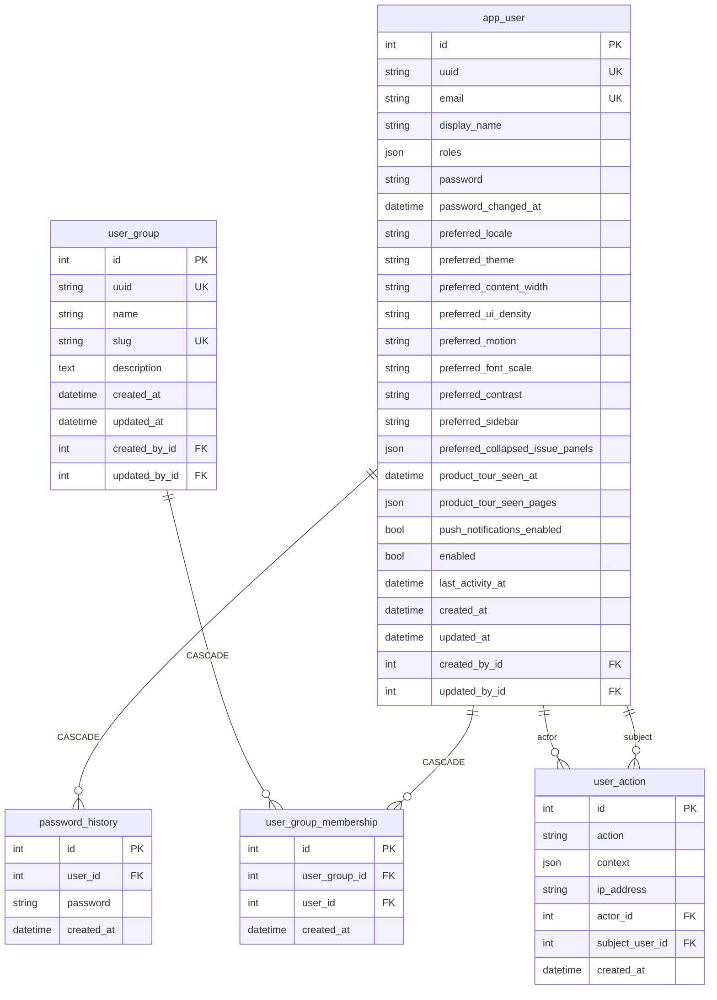
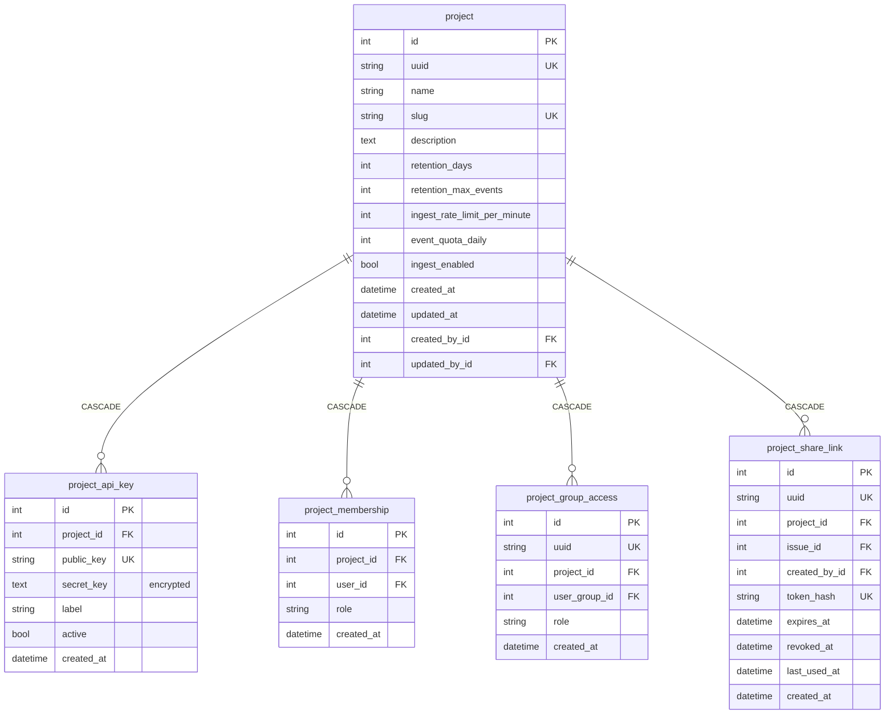
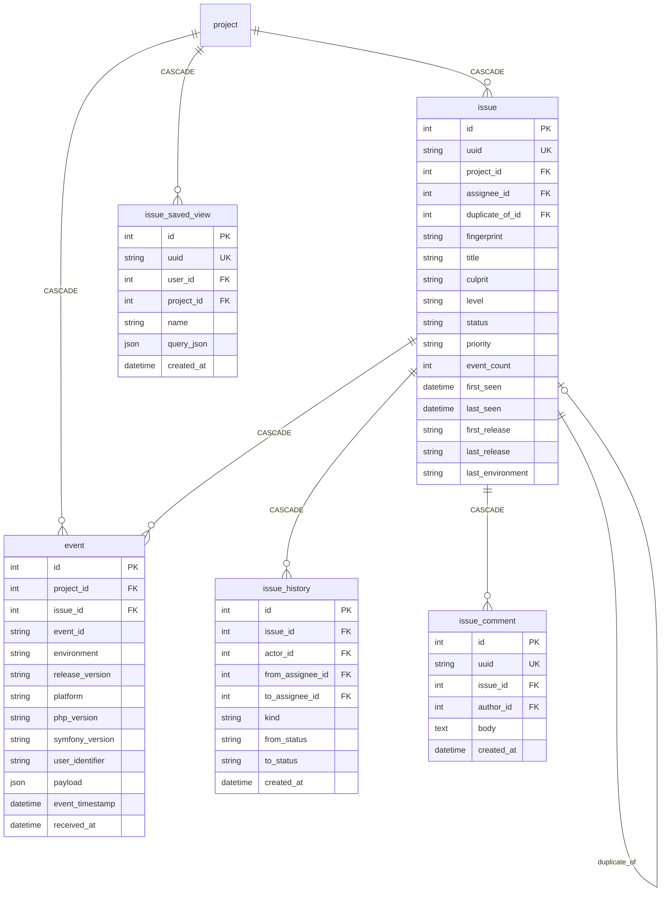
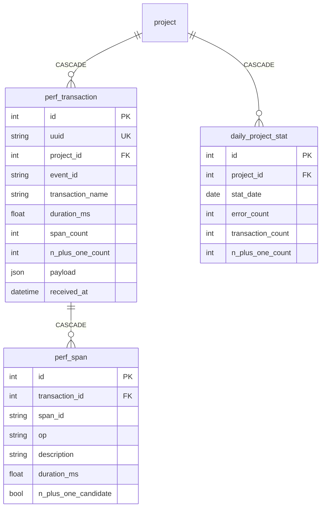
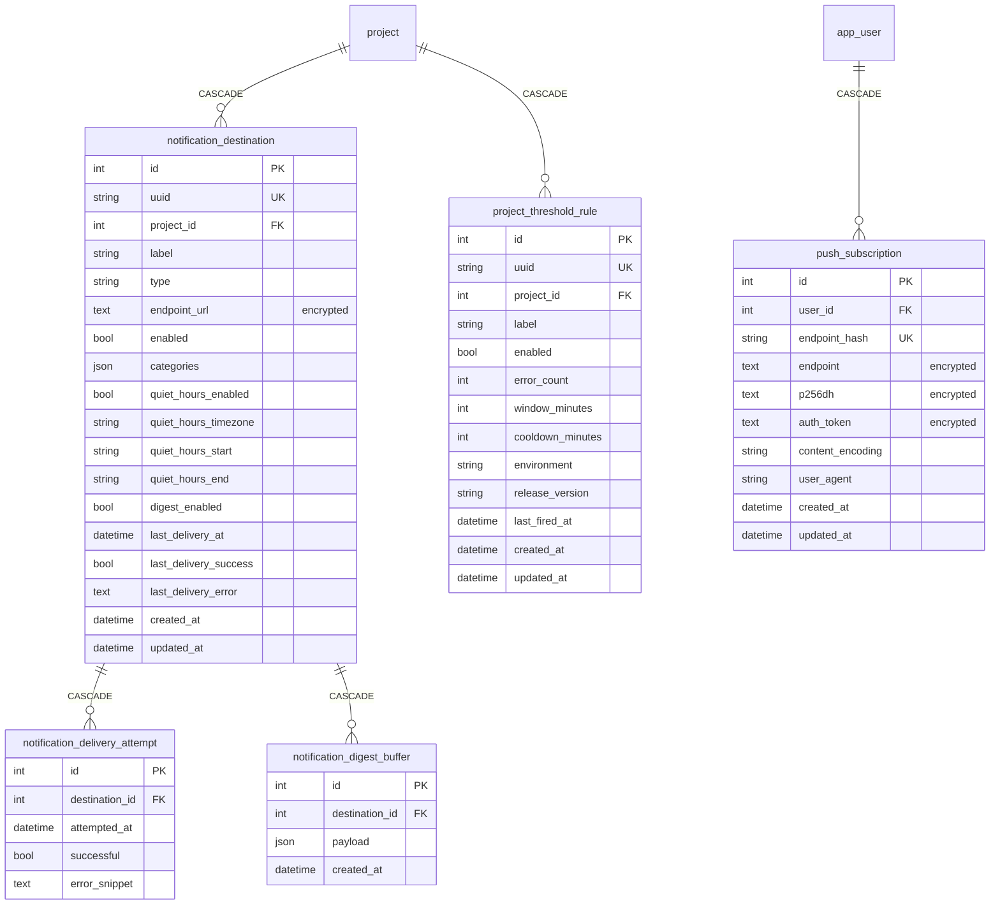
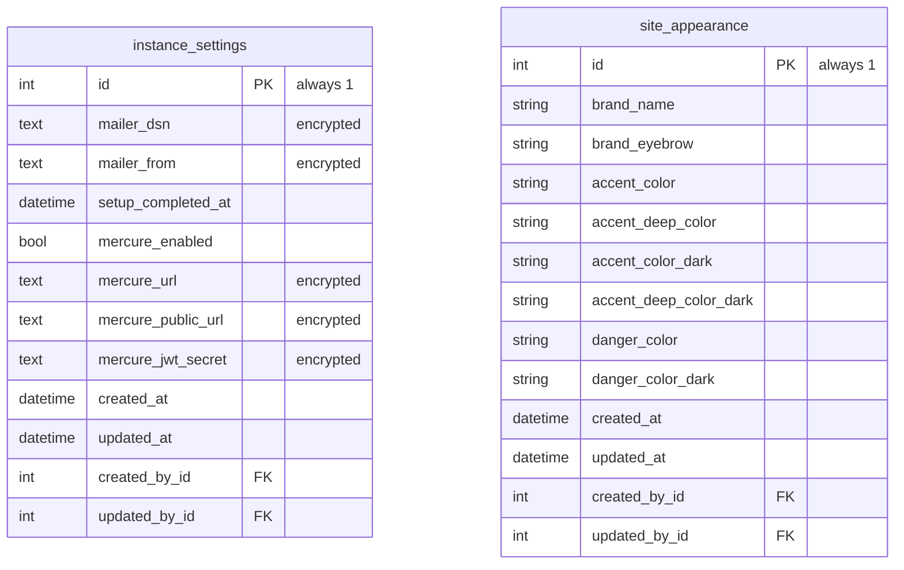

# Database schema

Beacon persists application data with **Doctrine ORM** on **MySQL** (Compose service `database`; local data under `./.data/mysql`).

This page documents the **App\\** entity model (tables under `src/`). Kit tables from `nowo-tech/*` bundles (menus, breadcrumbs, cookie consent, login throttle, …) are owned by those packages and are omitted here.

## Conventions

| Topic | Behaviour |
|-------|-----------|
| Naming | Underscore columns (`doctrine.orm.naming_strategy.underscore`) |
| IDs | Integer auto-increment PKs unless noted |
| Public ids | Many entities also have a `uuid` string(36) for URLs |
| Soft secrets | `#[Encrypted]` (Halite): API secrets, webhook URLs, push keys, Mailer/Mercure settings |
| Singletons | `instance_settings.id = 1`, `site_appearance.id = 1` |
| Join tables | Modelled as entities (`project_membership`, `user_group_membership`, `project_group_access`) |

Source of truth: entity mappings under `src/**/Entity/` and migrations in `migrations/`.

---

## Overview (relationships)

```mermaid
erDiagram
    app_user ||--o{ password_history : has
    app_user ||--o{ project_membership : member_of
    app_user ||--o{ user_group_membership : in
    app_user ||--o{ push_subscription : owns
    app_user ||--o{ user_action : actor_or_subject
    app_user ||--o{ issue : assignee
    app_user ||--o{ issue_comment : author
    app_user ||--o{ issue_saved_view : owns
    app_user ||--o{ project_share_link : created_by

    user_group ||--o{ user_group_membership : has
    user_group ||--o{ project_group_access : grants

    project ||--o{ project_membership : has
    project ||--o{ project_group_access : has
    project ||--o{ project_api_key : has
    project ||--o{ project_share_link : has
    project ||--o{ issue : has
    project ||--o{ event : denormalized
    project ||--o{ perf_transaction : has
    project ||--o{ daily_project_stat : has
    project ||--o{ notification_destination : has
    project ||--o{ project_threshold_rule : has
    project ||--o{ issue_saved_view : has

    issue ||--o{ event : has
    issue ||--o{ issue_history : has
    issue ||--o{ issue_comment : has
    issue ||--o| issue : duplicate_of
    issue ||--o{ project_share_link : scoped

    perf_transaction ||--o{ perf_span : has

    notification_destination ||--o{ notification_delivery_attempt : has
    notification_destination ||--o{ notification_digest_buffer : buffers
```

---

## Identity

---

## Project & access

Roles on memberships / group access: `owner` | `admin` | `member` | `viewer`.

---

## Issues & events

Uniqueness: `(project_id, fingerprint)` on `issue`; `(project_id, event_id)` on `event`. FULLTEXT index on `issue(title, culprit)`.

---

## Performance & analytics

Uniqueness: `(project_id, stat_date)` on `daily_project_stat`.

---

## Notifications & push

---

## Instance settings & appearance

Admin UI: **Administration → Mailer** / **Mercure** / **Appearance**. See [MERCURE.md](MERCURE.md) and [PRODUCTION.md](PRODUCTION.md#field-encryption-key-halite).

---

## Related

- Architecture flows: [ARCHITECTURE.md](ARCHITECTURE.md)
- Migrations: `migrations/`
- Local MySQL bind mount: `./.data/mysql` in [`compose.yaml`](../compose.yaml)
