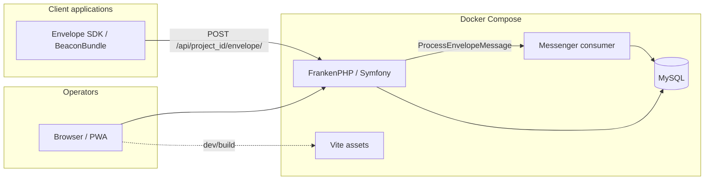
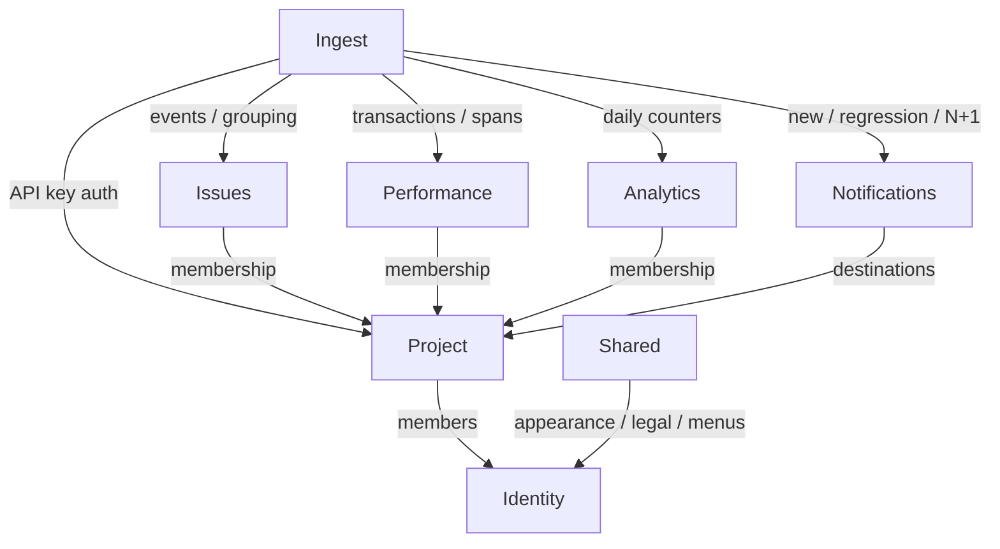
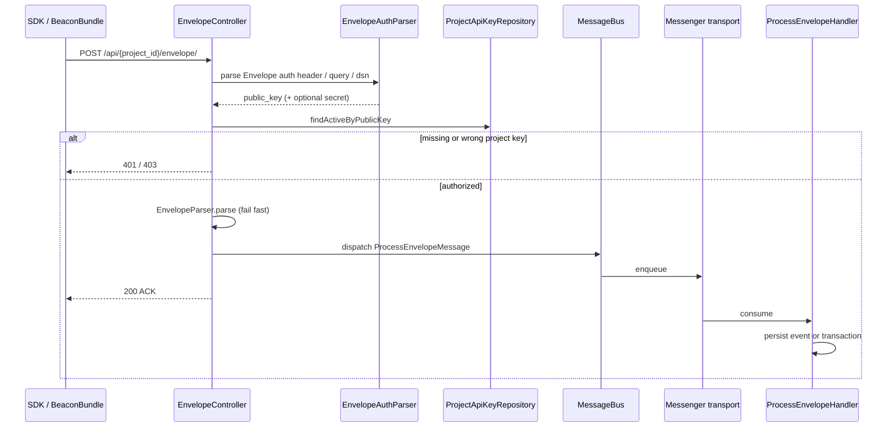
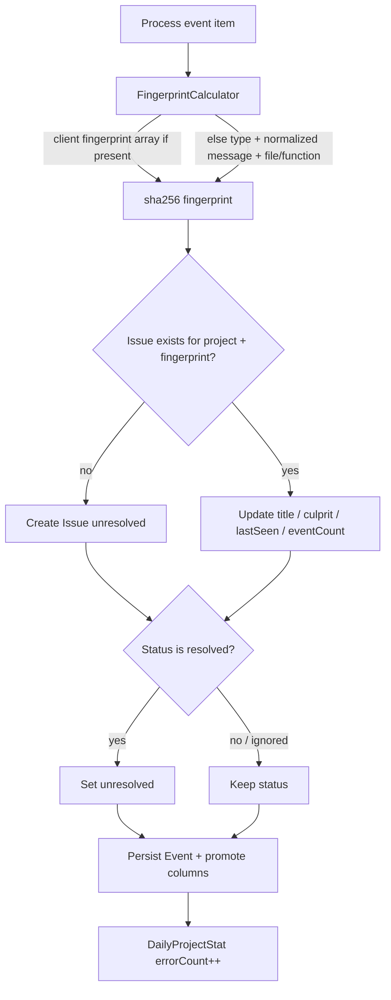
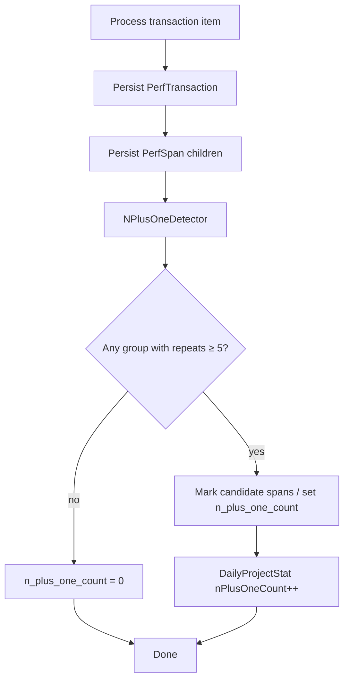
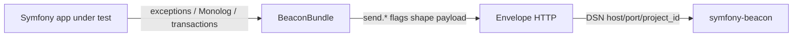

# Architecture rationale

This document explains **why** Symfony Beacon uses its current shape: modular Symfony packages, FrankenPHP, Envelope-compatible ingest, Messenger, Twig + Vite, and Nowo.tech kits — instead of a full DDD/hexagonal rewrite, a separate SPA, or a classic Nginx+FPM stack.

Normative constraints live in [`.specify/memory/constitution.md`](../.specify/memory/constitution.md). Coding rules for the HTTP runtime are in [frankenphp-coding.md](frankenphp-coding.md).

## Product constraints that drive the design

Beacon is a **self-hosted error-tracking server** for PHP/Symfony operators. It must:

1. Accept telemetry that existing SDKs already know how to send (**Envelope wire protocol**).
2. Acknowledge ingest **quickly** under bursty error traffic.
3. Offer a usable operator UI (browser and installable PWA) without requiring a SaaS account.
4. Stay operable by a small team: Docker-first, Spec-Driven Development, English docs.

Those constraints favour a familiar Symfony modular app over an academic layered architecture.

## Why modular Symfony (not full DDD / hexagonal)

| Choice | Rationale |
|--------|-----------|
| Packages under `src/{Identity,Project,Ingest,…}` | Boundaries follow **product capabilities** (ingest vs issues vs performance), which match how features are specified and released. |
| Controllers + Doctrine entities + focused services | Matches Symfony Flex conventions contributors already know; less ceremony than ports/adapters for a single deployable app. |
| Explicit “no full DDD/hexagonal” | Hexagonal layers pay off when many adapters or bounded contexts compete. Beacon has one primary write path (Envelope → Messenger → persistence) and one primary read path (Twig UI). Extra layers would slow Spec Kit delivery without clear gain. |

Modules stay **thin and directional**: Ingest writes Issues/Performance/Analytics; UI modules read them. Shared holds cross-cutting UI glue (appearance, legal, menus), not a generic “domain kernel”.

## Why FrankenPHP + Docker (not Nginx+FPM on the host)

| Choice | Rationale |
|--------|-----------|
| `dunglas/frankenphp` image | One container serves HTTP (Caddy) and PHP; fewer moving parts for self-hosters. |
| Classic **or** worker via `FRANKENPHP_MODE` | Operators can trade isolation for throughput without forking the codebase. Application code targets **worker-safe** behaviour so both modes remain valid. |
| Docker Compose as the required local env | Reproducible MySQL, Messenger consumer, Vite, and Caddy ports; no “works on my host PHP” drift. |

See [production.md](production.md) for the optional baked prod image target.

## Why fast ACK + Symfony Messenger

Ingest is the hot path. The constitution requires Envelope endpoints to **authenticate and acknowledge quickly**, then process asynchronously.

| Choice | Rationale |
|--------|-----------|
| `POST /api/{project_id}/envelope/` | Envelope-compatible URL shape; SDKs and `nowo-tech/beacon-bundle` can point a DSN at any host/port. |
| Auth via Envelope auth header / query / envelope `dsn` | Wire compatibility with Envelope clients; mapped to project API keys. |
| Messenger (`ProcessEnvelopeMessage`) | Grouping, fingerprinting, N+1 detection, and daily stats are CPU/DB heavy — they must not block the ACK. |
| Separate `messenger` Compose service | Ingest HTTP workers stay responsive while a dedicated consumer drains the queue. |

## Why Twig + Vite/Stimulus (not a separate SPA)

| Choice | Rationale |
|--------|-----------|
| Server-rendered Twig | Auth, CSRF, flash messages, and permission checks stay in one stack; good fit for an operator console. |
| Stimulus | Progressive enhancement for interactive widgets (DataTables, clipboard, collapse panels). |
| Vite + TypeScript + Tailwind 4 | Modern asset pipeline without splitting the product into “API repo + frontend repo”. |
| PWA | Same Twig app is installable via `nowo-tech/pwa-bundle` (see [native-mobile.md](native-mobile.md) for removed Hotwire Native notes). |

A dedicated SPA would force a second auth model, duplicated validation, and larger ops surface for little benefit on CRUD-heavy admin screens.

## Why Nowo.tech kits over hand-rolled auth/legal UX

Login, registration, cookies, menus, and forms are solved problems. Prefering [`nowo-tech/*`](https://packagist.org/packages/nowo-tech/) kits:

- Keeps Beacon focused on **telemetry** (ingest, grouping, performance, analytics).
- Reuses tested AuthKit / cookie-consent / dashboard-menu / form-kit behaviour.
- Leaves room for operator legal pages without inventing a consent stack ([legal-and-cookies.md](legal-and-cookies.md)).

Identity in this repo owns **User** persistence and project membership; AuthKit owns the login/register chrome.

## Why Envelope compatibility (and a separate BeaconBundle)

| Choice | Rationale |
|--------|-----------|
| Envelope protocol on the server | Operators can point Envelope-compatible clients (especially `nowo-tech/beacon-bundle`) at this server immediately. |
| `nowo-tech/beacon-bundle` in another repository | Client instrumentation (Monolog, exceptions, `send.*` flags, stack source context) evolves on the app side without coupling release cycles to the server. DSN = host/port/project against this server. |

Promoted event columns (environment, release, PHP/Symfony versions, …) exist for **UI and filters**; full JSON in `event.payload` remains the source of truth ([event-context.md](event-context.md)).

## Why Spec-Driven Development

Features are specified under `specs/` before large changes. That matches an open-source product where:

- Acceptance criteria must stay reviewable without reading every PR.
- Architecture decisions (this doc + constitution) are amendable, not tribal knowledge.
- PHPUnit coverage is tied to scenarios in each feature spec.

## Module map (as-built)

| Module | Responsibility | Why it is separate |
|--------|----------------|--------------------|
| `Identity` | Users, account prefs, seed | Auth boundary; kits + Security |
| `Project` | Projects, keys, memberships, Settings / danger zone | Multi-tenant tenancy unit |
| `Ingest` | Envelope HTTP + async pipeline | Latency-sensitive write path |
| `Issues` | Fingerprint grouping, list/detail, assignee | Primary debugging UX |
| `Performance` | Transactions, spans, N+1 | Distinct Envelope item type and UI |
| `Analytics` | Daily aggregates | Read models derived from ingest |
| `Notifications` | Slack / HTTP webhook destinations | Outbound alerts after ingest |
| `Shared` | Appearance, menus/breadcrumbs glue, legal | Cross-cutting presentation |

## Flows (Mermaid)

The diagrams below describe the **as-built** runtime paths. They complement the rationale above; implementation details live under `src/` and the feature specs.

### System context

How operators, client apps, and Compose services relate to Beacon.



### Module dependencies

Write path vs read path. Arrows mean “uses / writes into”.



### Envelope ingest (fast ACK)

HTTP request authenticates, validates parseability, dispatches Messenger, and returns. Heavy work is **not** on the request thread.



### Event item → issue grouping

After dequeue, event items update (or create) an `Issue` by fingerprint, store `Event`, and bump daily error stats. Resolved issues reopen; ignored do not.



### Transaction item → N+1

Transaction envelopes create `PerfTransaction` / `PerfSpan` rows and run `NPlusOneDetector` (≥5 similar db-like spans).



### Operator UI access

Session login (AuthKit) then project-scoped membership checks on every project page.

```mermaid
flowchart TD
  Anon[Anonymous request] --> Gate{Authenticated?}
  Gate -->|no| Login[AuthKit /en/login]
  Login --> Dash[/dashboard]
  Gate -->|yes| Dash
  Dash --> Pick[Open project]
  Pick --> Home[Redirect to Issues]
  Home --> Access[ProjectAccessService.requireMembership]
  Access -->|member+| UI[Issues / Performance / Analytics / Settings]
  Access -->|not a member| Deny[403]
  UI --> Role{Action needs elevated role?}
  Role -->|clear history: owner/admin| OK1[Allowed]
  Role -->|delete project: owner| OK2[Allowed]
  Role -->|insufficient| Deny
```

### Client instrumentation → Beacon

Server and client repos stay decoupled; DSN points at this host.



## Deliberate non-goals

- **Not** a multi-region SaaS control plane.
- **Not** a generic observability backend (metrics/logs/traces as first-class products).
- **Not** a mobile-only API + React Native client in this repository.
- **Not** replacing Envelope with a proprietary ingest protocol.

When a change would violate these non-goals or the constitution stack, amend the constitution and add a feature spec first.
