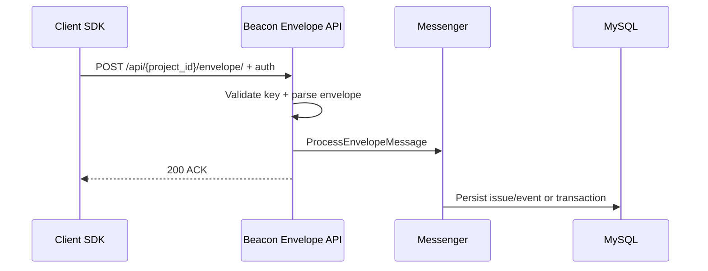

# Connecting SDKs (DSN)

symfony-beacon accepts the **Envelope** wire protocol.

## DSN format

```text
https://<public_key>@<host>:<port>/<project_id>
```

Example (local HTTPS UI):

```text
https://9cb5e28adc3ed7a40052e2a17e327220@localhost:9444/1
```

Docker clients (BeaconBundle FrankenPHP demo) should prefer **HTTP ingest** on port `9081` via `host.docker.internal` — Caddy serves `/api/*` on HTTP for those hosts; browsers keep using HTTPS `:9444`.

```text
http://PUBLIC_KEY@host.docker.internal:9081/1
```

Create keys from the project settings page (owner/admin) or via `bin/console app:seed-demo` / `make seed`.

### Local demo sync (BeaconBundle)

`make seed` / `make bootstrap` writes `.demo-client.env` with a Docker-ready `BEACON_DSN` (`http://…@host.docker.internal:9081/{id}`).

In the sibling repo `BeaconBundle/demo/symfony8`:

```bash
make sync-beacon   # or make up (syncs before starting)
```

Override the Beacon checkout path with `BEACON_REPO=/path/to/symfony-beacon`.

## Preferred client (BeaconBundle)

Install [`nowo-tech/beacon-bundle`](https://github.com/nowo-tech/BeaconBundle) and set `BEACON_DSN` to this server (any host/port):

```env
BEACON_DSN=https://PUBLIC@localhost:9444/1
```

The bundle authenticates by embedding the DSN in the envelope header and uses `Content-Type: application/x-beacon-envelope`.

Ingest endpoint:

```http
POST /api/{project_id}/envelope/
Content-Type: application/x-beacon-envelope
```

## Auth

Supported Envelope mechanisms (mapped to project API keys):

- Envelope auth header with `public_key` / optional secret pairs (wire field names `sentry_key` / `sentry_secret` for protocol compatibility)
- Query string `?sentry_key=…` (same wire field name)
- Envelope header `"dsn": "https://…"`

The public key must belong to the `{project_id}` in the URL.

### Ingest sequence (overview)

Full architecture diagrams (module map, grouping, N+1, UI access) live in [architecture.md](architecture.md#flows-mermaid).



## Async processing

The HTTP endpoint validates the key and envelope, dispatches `ProcessEnvelopeMessage`, and returns `200` quickly. The Compose `messenger` service persists issues/events/transactions.

## Client capabilities (BeaconBundle)

| Capability | Envelope | Beacon UI |
|------------|----------|-----------|
| Events (`captureMessage` / `captureException`) | item `type: event` | Issues |
| User context (`send.user`) | payload `user` | Event detail |
| Breadcrumbs (`addBreadcrumb`) | payload `breadcrumbs.values` | Event detail |
| Performance (`captureTransaction`) | item `type: transaction` | Performance |
| Contexts (PHP / Symfony / OS) | payload `contexts` | Event detail |

From a FrankenPHP demo container, prefer HTTP to the published host port, e.g. `http://PUBLIC@host.docker.internal:9081/1`.
