# Symfony Beacon — visual identity

English **brand book** for designers and implementers. It is the source for mark, colour, type, mascot, and how those assets land on real product screens.

This is **not** the operator UI catalog. Screen-by-screen purpose, error meaning, and the full 1440×900 inventory live in [`docs/manual/`](../manual/README.md). Canonical runtime files stay under `public/brand/` and `public/illustrations/`. Preview copies used here are PNG under [`images/`](images/) — same pattern as `docs/manual/images/`.

| Companion | Role |
|-----------|------|
| [Product UI manual](../manual/README.md) | Operator catalog (REQ-DOCS-APP-003) |
| [Branded HTTP errors](../manual/08-errors.md) | Meaning + when each status appears |
| [GitHub wiki Home](../wiki/Home.md) | Index only — not a second brand dump |

---

## Contents

1. [Voice](#1-voice)
2. [Logo system](#2-logo-system)
3. [Colour](#3-colour)
4. [Typography](#4-typography)
5. [Geometry and chrome](#5-geometry-and-chrome)
6. [Mascot](#6-mascot)
7. [Error illustrations](#7-error-illustrations)
8. [Applied screens](#8-applied-screens)
9. [Do / don’t](#9-do--dont)
10. [File inventory](#10-file-inventory)
11. [Verify](#11-verify)

---

## 1. Voice

Beacon is **self-hosted error tracking** for PHP and Symfony. The identity is calm, moss-green, and slightly technical — a signal tower, not a SaaS neon dashboard.

| Attribute | Do | Don’t |
|-----------|----|-------|
| Tone | Quiet confidence, short sentences | Alarmist red chrome on every surface |
| Metaphor | Emitter / tower / concentric signal arcs | Cloned sibling mascots (lynx, etc.) |
| Eyebrow | `ERROR TRACKING` (`SiteAppearance::DEFAULT_BRAND_EYEBROW`) | Invent a second tagline in host CSS |
| Product name | `symfony-beacon` (wordmark, lowercase, hyphen) | `Symfony Beacon` in the lockup, stretched type, or outline |
| Copy on errors | Calm title + one lead + optional light hint | Blame, stack traces, debug dumps |

Operators may restyle an instance from Administration → Appearance. **Shipped identity** is the Beacon moss preset below — not Ocean, Slate, Sandstone, Midnight, Obsidian, Aurora, or Ember. Those tiles are optional operator palettes, not extra official brands.

---

## 2. Logo system

The mark is an **emitter + tower + three concentric arcs** (50° opening from the bottom). Fill and stroke are always **`#4aad7f`** (`--beacon-mark`), in both day and night. The wordmark is Montserrat 600, letter-spacing `-0.01em`.

### Mark

Use the mark alone on favicons, PWA icons, and tight chrome (sidebar collapse, app icon). Minimum practical size: **24×24 px** in UI. Product chrome prefers `public/brand/beacon-mark.svg`.

### Wordmark — day

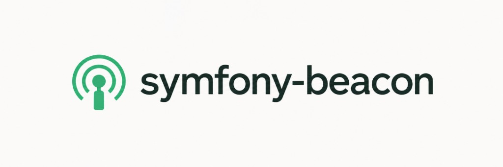

Wordmark fill on light: `#1a202c`. Place on paper / mist, never on moss.

### Wordmark — night

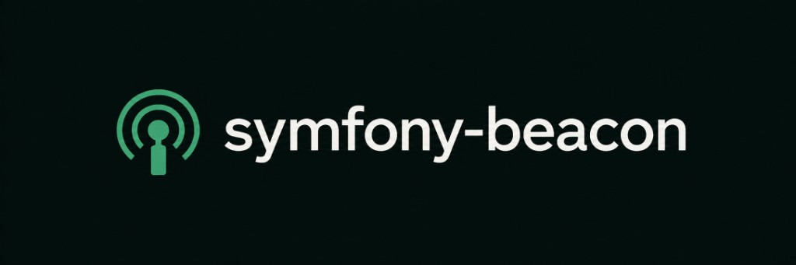

Wordmark fill on dark: `#ffffff`. The mark stays `#4aad7f` — do not lighten it to match the moss button.

### App icon

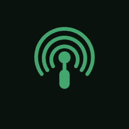

Ink field `#0a120e`, mark centred. Use for PWA / install surfaces (`public/brand/beacon-app-icon.svg`).

### Clear space and lockup

- Keep clear space around the mark at least **one tower-width** (the filled base rectangle).
- Do not crop the three arcs.
- Do not stack a second logotype under the SVG wordmark.
- Raster fallbacks (`public/brand/logo-light.jpg`, `logo-dark.jpg`, `beacon-mark.png`) exist for README / social; prefer SVG in product chrome.

### Misuses

| Don’t | Why |
|-------|-----|
| Recolor the mark to Symfony purple, UiKit blue, or a sibling accent | Mark is `#4aad7f` in both themes |
| Stretch, outline, or add drop shadows to the SVG lockup | Distorts the signal-tower geometry |
| Put the dark (white) wordmark on moss, or the light wordmark on ink | Contrast fails |
| Place the lockup on a busy photograph without a paper/ink plate | Arcs disappear |

---

## 3. Colour

Canonical tokens are `--beacon-*` in `assets/styles/tailwind.css`. PHP defaults live on `SiteAppearance::DEFAULT_*`. Kit chrome remaps `--nowo-ui-*` and `--nowo-auth-kit-*` onto these values — do not leave UiKit slate-blue (`#0f172a` / `#60a5fa`) visible.

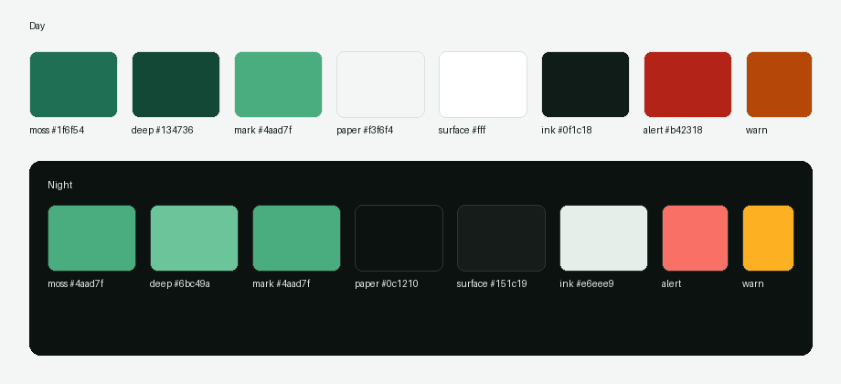

| Token | Day | Night | Role |
|-------|-----|-------|------|
| `--beacon-moss` | `#1f6f54` | `#4aad7f` | Primary actions, PWA `theme_color` (day) |
| `--beacon-moss-deep` | `#134736` | `#6bc49a` | Hover / pressed |
| `--beacon-mark` | `#4aad7f` | `#4aad7f` | Logo mark only (stable) |
| `--beacon-paper` | `#f3f6f4` | `#0c1210` | Page field + public grid |
| `--beacon-surface` | `#ffffff` | `#151c19` | Cards, auth panel |
| `--beacon-ink` | `#0f1c18` | `#e6eee9` | Body text |
| `--beacon-sand` | `#d8e2dc` | `#2a3832` | Borders |
| `--beacon-mist` | `#e7f0eb` | `#17201c` | Muted fills, nav active |
| `--beacon-alert` | `#b42318` | `#f97066` | Danger |
| `--beacon-warn` | `#b54708` | `#fdb022` | Warning |
| `--beacon-surface-muted` | `#f7faf8` | `#1a2320` | Nested panels |

PWA: `theme_color` `#1f6f54`, `theme_color_dark` `#4aad7f` (`config/packages/nowo_pwa.yaml`).

**Contrast:** body text is ink on paper/surface. Primary buttons are moss with white (day) or ink (night) label. Danger stays `--beacon-alert`, not moss.

**Kits:** AuthKit, SiteBackup, UiKit, CookieConsent, and MaintenanceMode public chrome must consume `--beacon-*` (or the `--nowo-*-*` aliases already remapped in `tailwind.css`). Do not introduce a second `--app-*` slate palette on Beacon.

---

## 4. Typography

| Role | Family | Where |
|------|--------|-------|
| UI / display | **Montserrat** (`--font-sans`, `--font-display`) | Shell, auth, marketing eyebrow |
| Mono | **IBM Plex Mono** (`--font-mono`) | DSN, codes, setup logs |

Do not introduce a third family in host SCSS. Wordmark SVG already names Montserrat so the lockup matches even when the raster fallback is used.

Eyebrow on public chrome is small, wide-tracked, moss (`ERROR TRACKING`). Page titles are ink, sentence case except product wordmark.

---

## 5. Geometry and chrome

| Token | Default | Notes |
|-------|---------|-------|
| `--beacon-radius-card` | `0.75rem` | Cards, auth panel |
| `--beacon-radius-control` | `0.375rem` | Buttons, inputs (soft) |
| `--beacon-border-width` | `1px` | Sand borders |

Administration may switch sharp / soft / rounded; identity shots use the shipped **soft** defaults.

**Guest chrome** (login, legal, HTTP errors): paper field, faint grid, wordmark + eyebrow, no dashboard shell, no cookie-consent dump on error pages. Theme and locale sit in the header on auth/legal; error pages keep a light public layout with theme toggle only.

**Authenticated chrome**: mark + wordmark in the shell header, mist active nav, moss primary CTA, white/ink surfaces for cards.

**Primary button:** moss fill, no extra shadow beyond `--beacon-shadow`. **Danger:** `--beacon-alert`. **Ghost / secondary:** sand border, ink text.

---

## 6. Mascot

The character is a **friendly white robot** with moss headset, a chest mark that repeats the beacon arcs, and three signal arcs on the antenna. Canonical source: `public/brand/mascot.png` — **PNG, RGBA, transparent canvas** (REQ-ERROR-001 item 9).

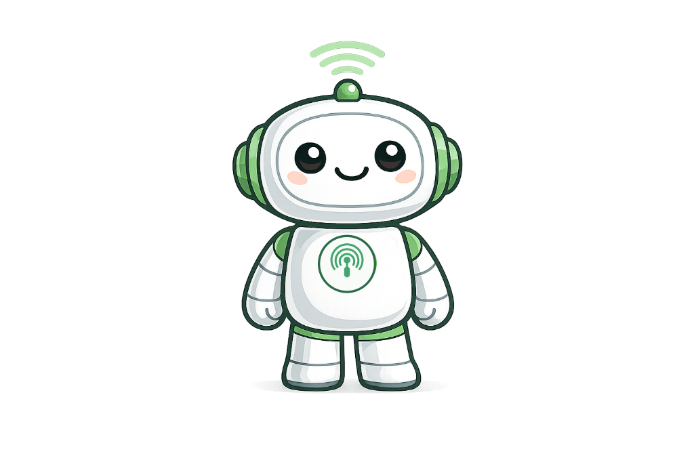

| Rule | Detail |
|------|--------|
| Use | Error illustrations, empty-but-friendly states, this identity book |
| Don’t | Swap in another matrix app’s mascot; photoreal humans; official third-party emblems; JPEG (or JPEG renamed `.png`); opaque white/black boxes |
| Format | Real PNG, IHDR color type 6, fully transparent pixels around the character |
| Pose | Idle standing pose is the source. HTTP errors **adapt** this character (map, wrench, hourglass) — they are not a different species |

---

## 7. Error illustrations

Runtime art lives under `public/illustrations/error-{400,401,403,404,408,429,500,502,503}.png` — same PNG + transparent-canvas rule as the mascot. Maintenance 503 reuses `error-503.png`. Cookie chrome may use `cookie-consent-bubble.svg`.

These files are **character art**, not the product UI manual. Operators see meaning + when-it-appears + 1440×900 **page** shots in [08 — Branded HTTP errors](../manual/08-errors.md).

Sample (404):

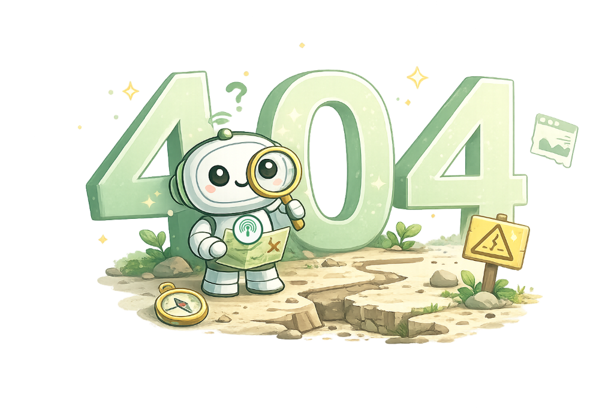

| Code | Pose (same robot) | Runtime file |
|------|-------------------|--------------|
| 400 | Puzzle pieces + warning triangle | `public/illustrations/error-400.png` |
| 401 | Checkpoint, access card | `public/illustrations/error-401.png` |
| 403 | Secured gate | `public/illustrations/error-403.png` |
| 404 | Map + magnifying glass | `public/illustrations/error-404.png` |
| 408 | Hourglass + alarm | `public/illustrations/error-408.png` |
| 429 | Pause on a message queue | `public/illustrations/error-429.png` |
| 500 | Repairing a server rack | `public/illustrations/error-500.png` |
| 502 | Reconnecting a glow cable | `public/illustrations/error-502.png` |
| 503 | Wrench + sandwich board (maintenance reuses this art) | `public/illustrations/error-503.png` |

Public error chrome: calm copy, moss CTA (“Back to home” / sign-in), light layout, **no** dashboard shell, **no** Symfony exception dump.

---

## 8. Applied screens

All shots are English, **1440×900**. Day is the catalog default; night is shown once on public and private chrome. Preview copies live in [`images/`](images/). Regenerate the operator inventory with `make docs-manual-screenshots`, then refresh these copies if lockup or moss tokens change.

### Public chrome — day (`/login`)

Wordmark + moss primary on paper grid. Eyebrow `ERROR TRACKING`. Theme and locale sit in the guest header.

### Public chrome — night

Same lockup; primary lightens to `--beacon-moss` `#4aad7f`; surfaces go ink.

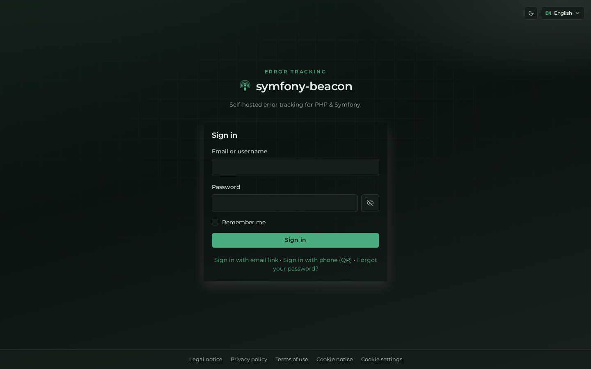

### Authenticated chrome — day (`/dashboard`)

Mark + wordmark in the shell header, moss primary on “New project”, mist active nav.

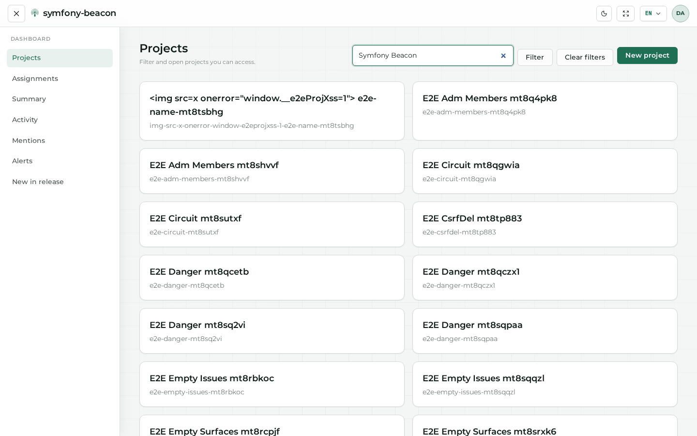

### Authenticated chrome — night

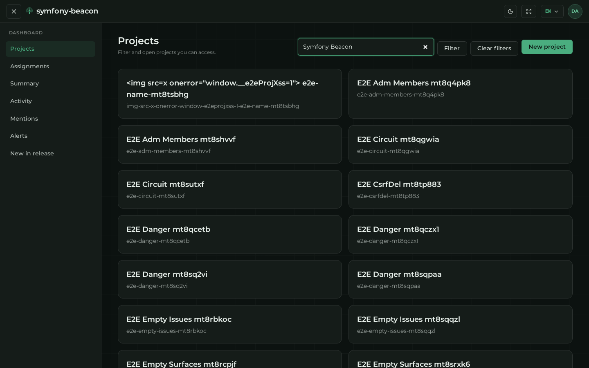

### Administration — Appearance

Shipped identity = **Beacon** light preset (and matching dark moss). Other tiles are optional operator palettes, not extra official brands.

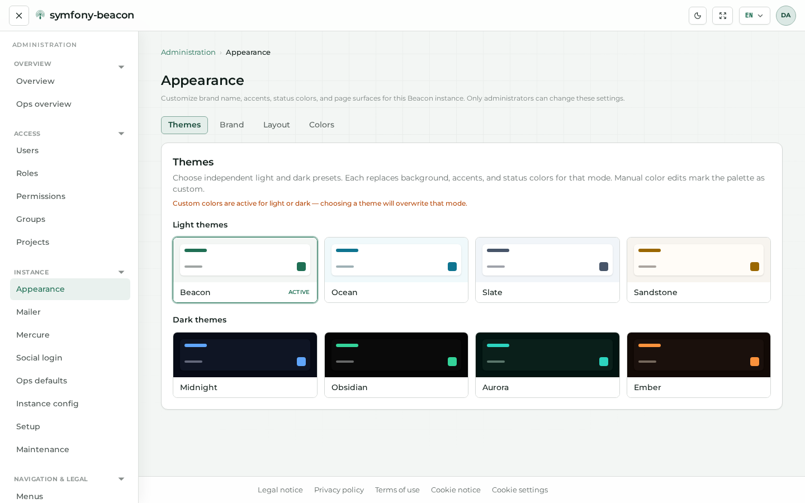

### Legal public page

Same guest paper grid and footer legal set as auth.

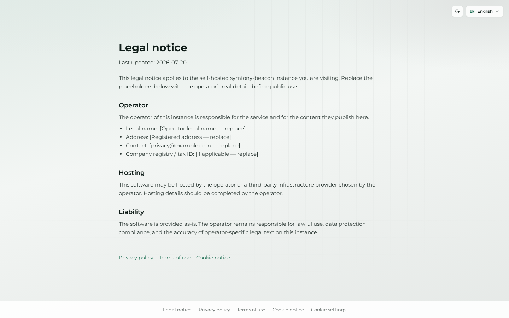

### HTTP 404 (branded)

Mascot illustration + short title + moss “Back to home”. Full status set: [08-errors.md](../manual/08-errors.md).

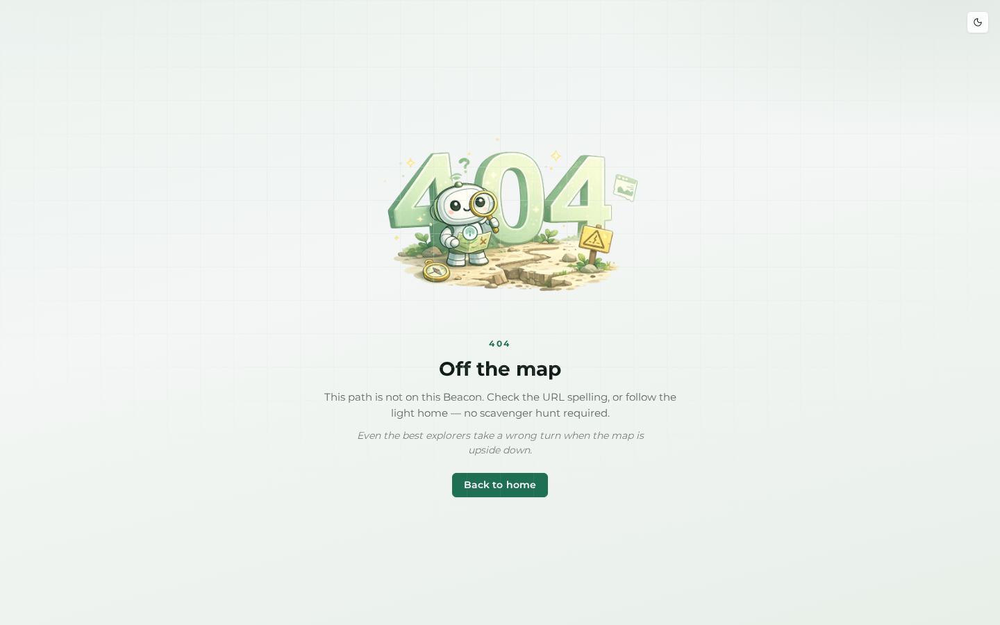

### Maintenance preview

Same 503 character art, public downtime chrome.

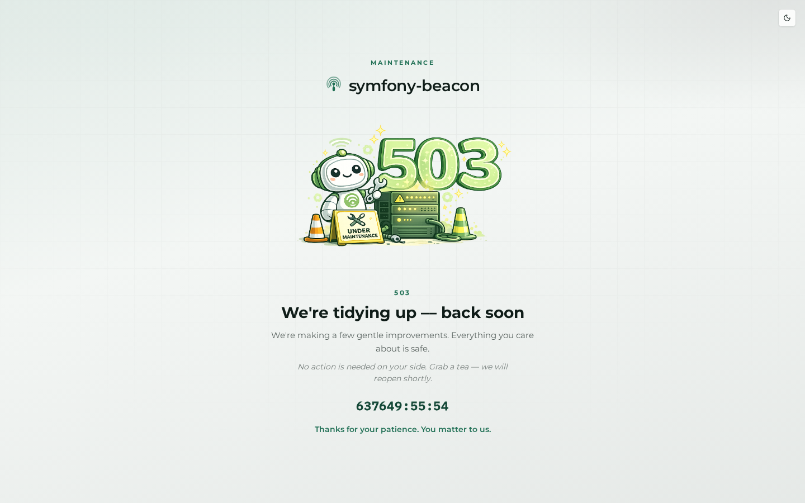

---

## 9. Do / don’t

**Do**

- Paint kit buttons, AuthKit, SiteBackup, and UiKit from `--beacon-*`.
- Keep the mark `#4aad7f` even when moss (buttons) is `#1f6f54`.
- Ship mascot and `error-*.png` as PNG RGBA with a punched canvas (PHPUnit `HttpErrorPagesTest`).
- Capture identity-related screens at 1440×900 English via `make docs-manual-screenshots`.
- Preserve this L&F when harvesting platform REQs onto siblings — copy the **manual shape**, not the robot.

**Don’t**

- Recolor the mark to Symfony purple, UiKit blue, or a sibling accent.
- Stretch, outline, or add drop shadows to the SVG lockup.
- Place the dark wordmark on moss, or the light wordmark on ink.
- Treat `public/illustrations/` dumps as the operator manual.
- Ship Ocean/Slate as “the Beacon brand” in marketing or docs.
- Clone this robot onto BP-v2, AgendaDesk, Fairshare, Hector, SmsBridge, or Aptum.

---

## 10. File inventory

| Asset | Canonical (runtime) | Book preview |
|-------|---------------------|--------------|
| Mark | `public/brand/beacon-mark.svg` | [`images/mark.png`](images/mark.png) |
| Wordmark light / dark | `public/brand/logo-light.svg`, `logo-dark.svg` | [`images/logo-light.png`](images/logo-light.png), [`images/logo-dark.png`](images/logo-dark.png) |
| App icon | `public/brand/beacon-app-icon.svg` | [`images/app-icon.png`](images/app-icon.png) |
| Mascot | `public/brand/mascot.png` | [`images/mascot.png`](images/mascot.png) |
| Error illustrations | `public/illustrations/error-{400…503}.png` | [`images/error-404-art.png`](images/error-404-art.png) |
| Palette | `--beacon-*` in `assets/styles/tailwind.css` | [`images/palette.png`](images/palette.png) |
| Applied screens | `docs/manual/images/` | [`images/auth-login.png`](images/auth-login.png) and siblings |

---

## 11. Verify

- This file is linked from [`docs/README.md`](../README.md) and [`docs/manual/README.md`](../manual/README.md).
- Hex values match `SiteAppearance` defaults and `tailwind.css`.
- Mascot and `error-*.png` runtime art are PNG RGBA with a transparent canvas (PHPUnit `HttpErrorPagesTest`).
- Every Markdown image in this file points at a PNG under `docs/identity/images/`.
- Wiki Home points here as a **related** doc, not as a screenshot dump.
