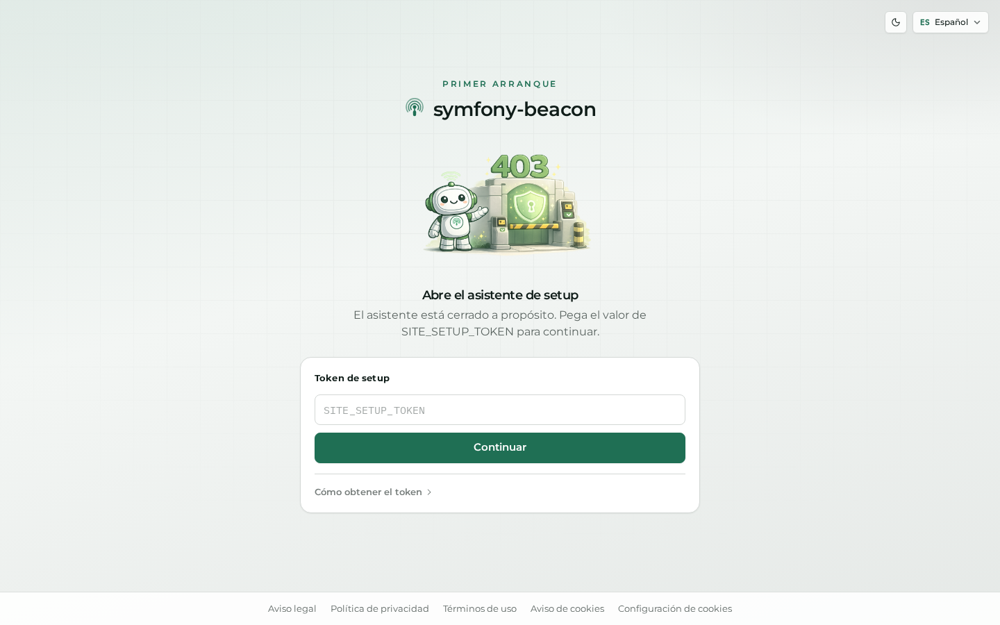
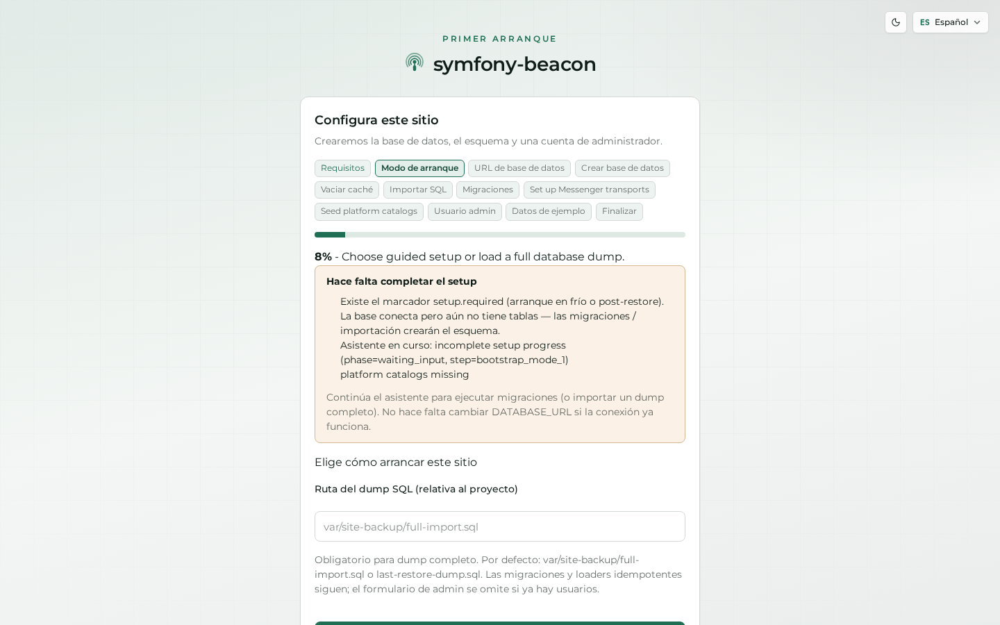
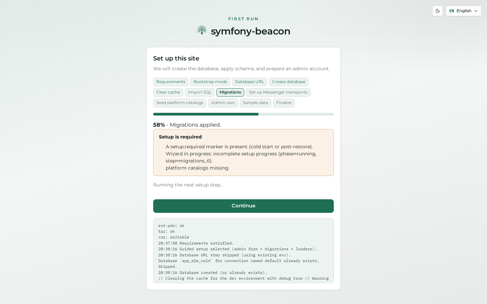
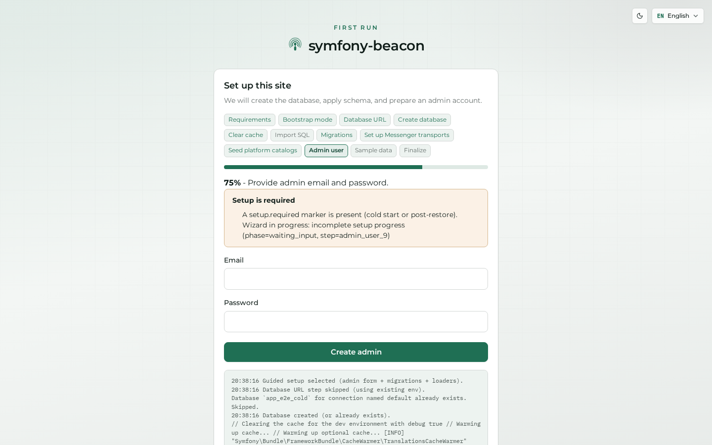
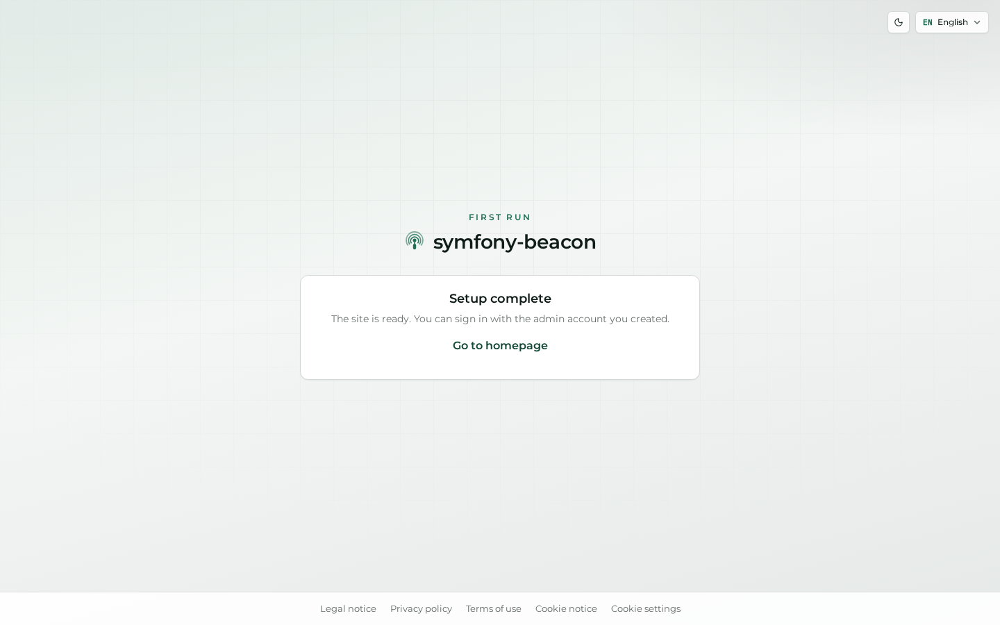

# First-time setup

A new Beacon instance is bootstrapped with the SiteBackup **setup wizard**. Until setup completes, AuthKit routes such as `/login` and `/register` redirect into setup (without exposing the setup token in the URL).

> **Safety:** Wizard screenshots use a disposable cold stack (`make wipe-e2e-cold`). Never advance `/setup/api/*` against dogfood or warm `app_e2e`.

## Auth gate

Visiting `/login` before setup completes lands on the setup gate.

## Wizard

Open with the local setup token (`beacon.local_setup_token` / default E2E `beacon-local-setup`):

`/setup?token=…`

Typical guided **fresh install** flow:

1. Choose profile / bootstrap mode  
2. Optional database URL (Compose `DATABASE_URL` when skipped)  
3. Migrations and platform seed  
4. Create the first **admin** account  
5. Optional sample data  
6. Completion → sign in  

After durable completion, the wizard redirects home. Continue with [Getting started](01-getting-started.md).

See also [INSTALL.md](../INSTALL.md). Theme and language controls work the same as elsewhere — [Theme and language](07-appearance.md).
