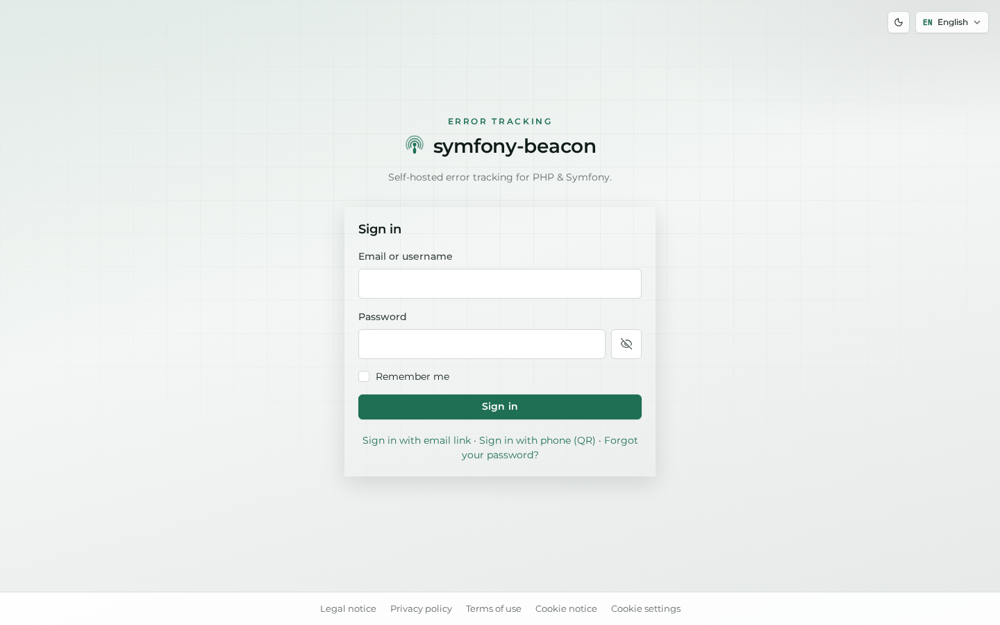
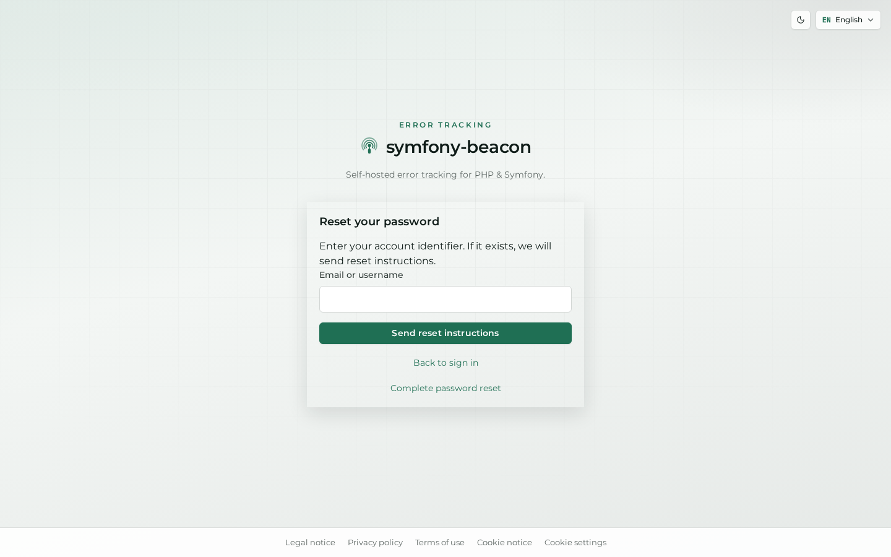
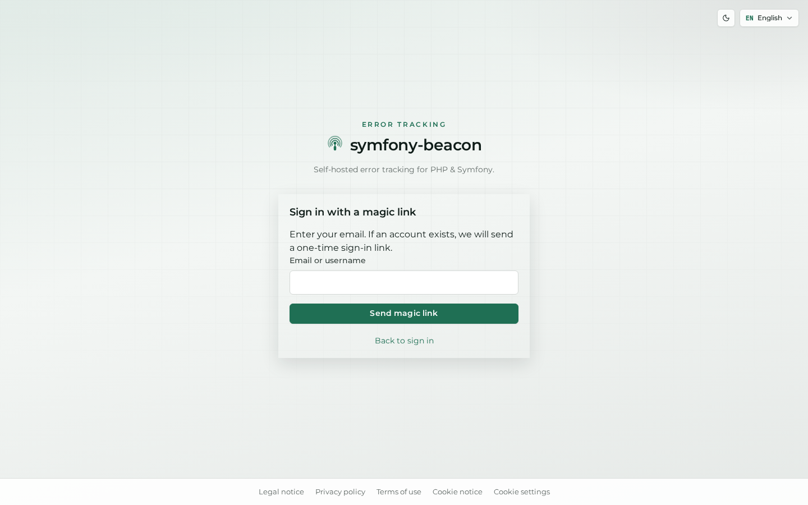
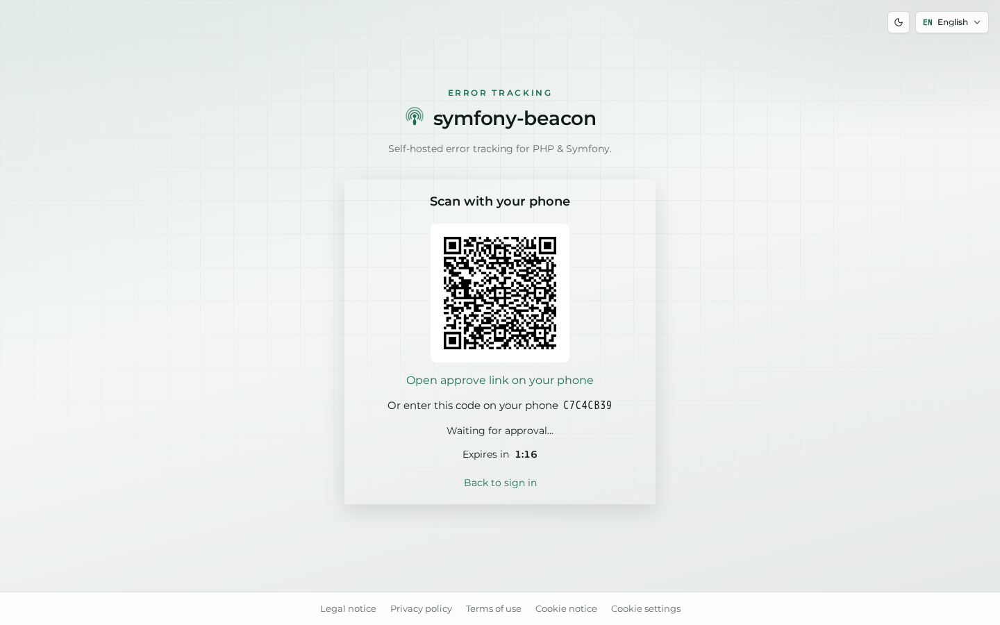

# Getting started

Authentication uses **AuthKit** (`nowo-tech/auth-kit-bundle`). On a fresh install, registration is typically **first-user-only**; seeded demos already include an admin.

Screenshots below are **English + day**. To switch theme or language, see [Theme and language](07-appearance.md).

This chapter covers every public AuthKit entry point: password sign-in, registration (when allowed), password reset, magic link, and QR / phone sign-in.

## Sign in

**Route:** `/login`

**What it is.** The primary credential form (email or username + password), with “Remember me” and links to alternate sign-in methods.

**What it contributes.** Secure access to the private UI. Footer links expose legal pages and cookie settings without requiring a session.

A successful sign-in opens the [dashboard](02-dashboard.md).

## Create an account

**Route:** `/register` (when registration is enabled for your instance policy)

**What it is.** The registration form for creating a new account under AuthKit rules (often limited to the first user on a cold install).

**What it contributes.** Lets the operator bootstrap membership without inventing a custom identity UI. If registration is closed, this screen is unavailable and admins create users under [Administration](05-admin-and-ops.md).

## Reset password

**Route:** password-reset entry from “Forgot your password?”

**What it is.** The recovery form that starts an email-based password reset.

**What it contributes.** Self-service account recovery. Mail delivery depends on [Administration → Mailer](05-admin-and-ops.md) (local stacks often use Mailpit).

## Magic link

**Route:** “Sign in with email link”

**What it is.** Passwordless sign-in: the user requests a one-time link sent by email.

**What it contributes.** Convenient access when password entry is inconvenient, while still relying on mailbox ownership. Requires a working mailer configuration.

## QR (phone) sign-in

**Route:** “Sign in with phone (QR)”

**What it is.** A phone / QR flow for signing in from another device after the account has a verified phone (see [Account → Profile](03-account.md#profile)).

**What it contributes.** Mobile-friendly authentication without typing the password on a shared screen.

## Next steps

- [Dashboard](02-dashboard.md) — projects home after sign-in  
- [Account](03-account.md) — profile, security, and privacy tools  
- [Legal pages](06-legal-and-privacy.md) — public legal and cookie copy  
