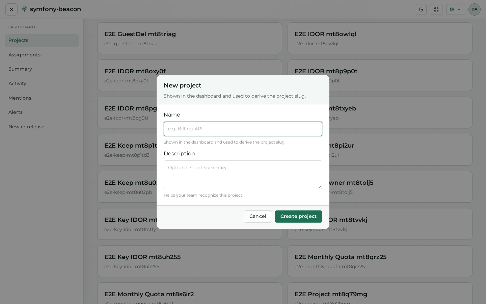

# Dashboard

After sign-in, the dashboard is the home for projects you can access, plus cross-project panels (assignments, activity, alerts, and related feeds).

Theme comparison for this private surface: [Theme and language](07-appearance.md#private-example-dashboard).

## Projects home

**Route:** `/dashboard` (Projects)

**What it is.** The project directory: filterable cards for every project your account can open, plus **New project**.

**What it contributes.** The primary navigation hub into issue tracking. Search and filters scale when many projects exist; each card opens that project’s Issues surface.

## Assignments

**Route:** `/dashboard/assignments`

**What it is.** Issues assigned to the signed-in user across projects you can access.

**What it contributes.** A personal work queue so you do not have to open each project to find your assigned items.

## Summary

**Route:** `/dashboard/summary`

**What it is.** Summary widgets that aggregate high-level counts and status across accessible projects.

**What it contributes.** A quick health snapshot before drilling into a single project’s Issues or Analytics tabs.

## Activity

**Route:** `/dashboard/activity`

**What it is.** A chronological feed of recent activity relevant to your memberships.

**What it contributes.** Situational awareness (what changed recently) without opening individual issue pages first.

## Mentions

**Route:** `/dashboard/mentions`

**What it is.** Items where you were mentioned or otherwise notified in conversation-style contexts.

**What it contributes.** Surfaces attention-needed discussions so mentions do not get lost in the general activity stream.

## Alerts

**Route:** `/dashboard/alerts`

**What it is.** Cross-project alert feed (threshold hits, delivery problems, and related signals depending on configuration).

**What it contributes.** Operator-facing visibility into alert traffic that projects raise via notification destinations and rules.

## New in release

**Route:** `/dashboard/new-in-release`

**What it is.** Issues first seen (or newly prominent) within the configured release window.

**What it contributes.** Helps triage regressions introduced by a deploy without manually comparing release filters on every project.

## Create a project

**What it is.** The **New project** flow from the projects home (modal or form depending on entry point). Companion shot continues the same viewport when the dialog is taller than 900px.

**What it contributes.** Creates a project shell you can later configure under Settings (access keys, alerts, retention). Admins can also create projects from [Administration → Projects](05-admin-and-ops.md#projects).

## Next steps

- [Projects and issues](04-projects-and-issues.md) — Issues, analytics, and project settings  
- [Account](03-account.md) — profile and preference surfaces  
