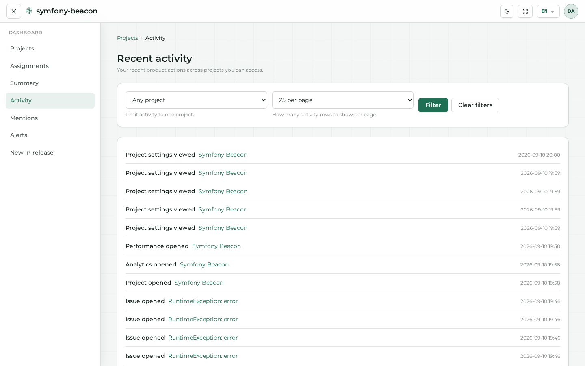
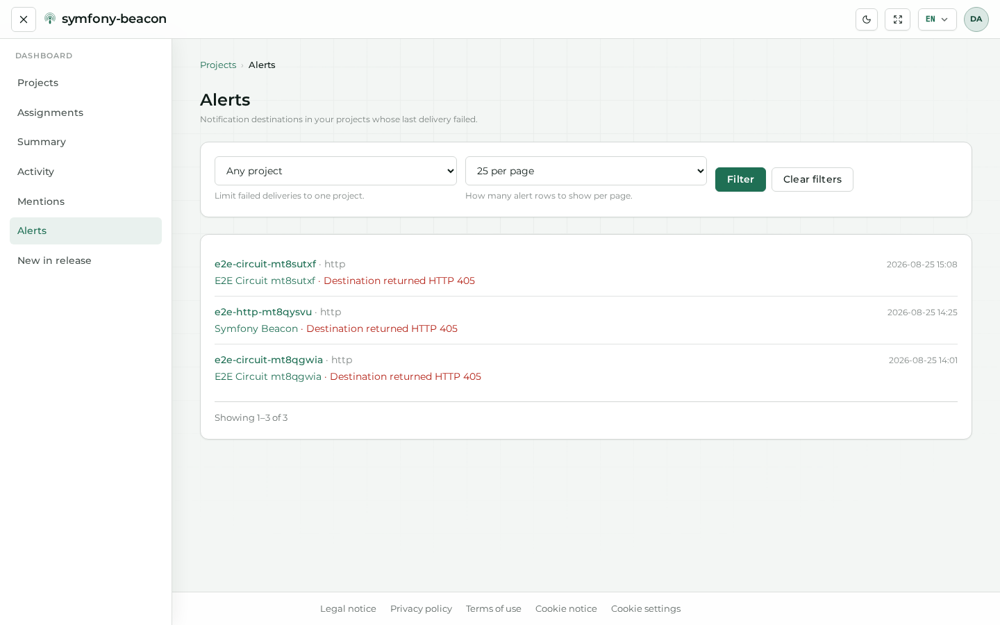
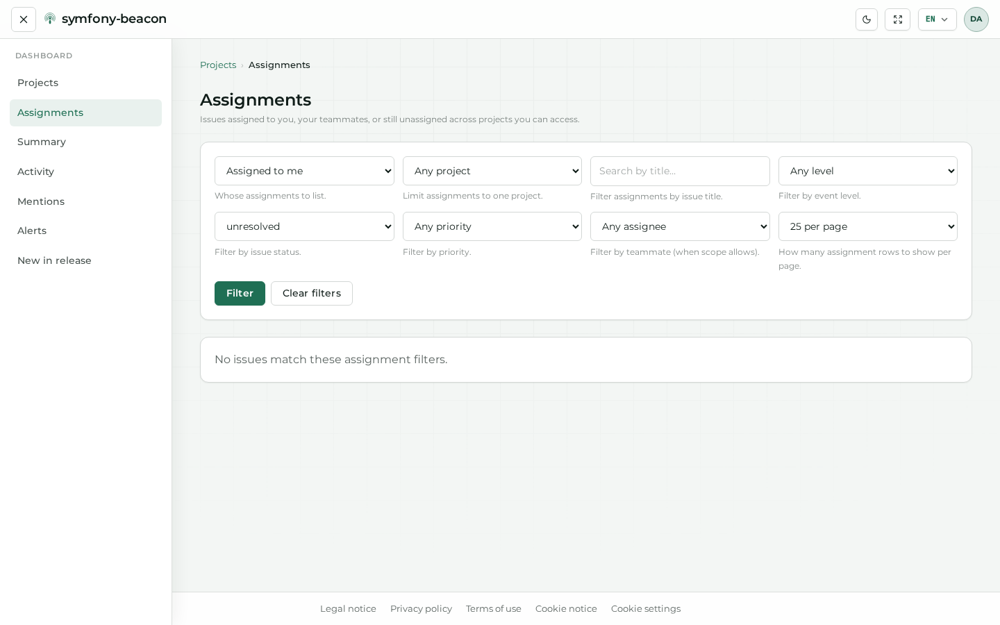
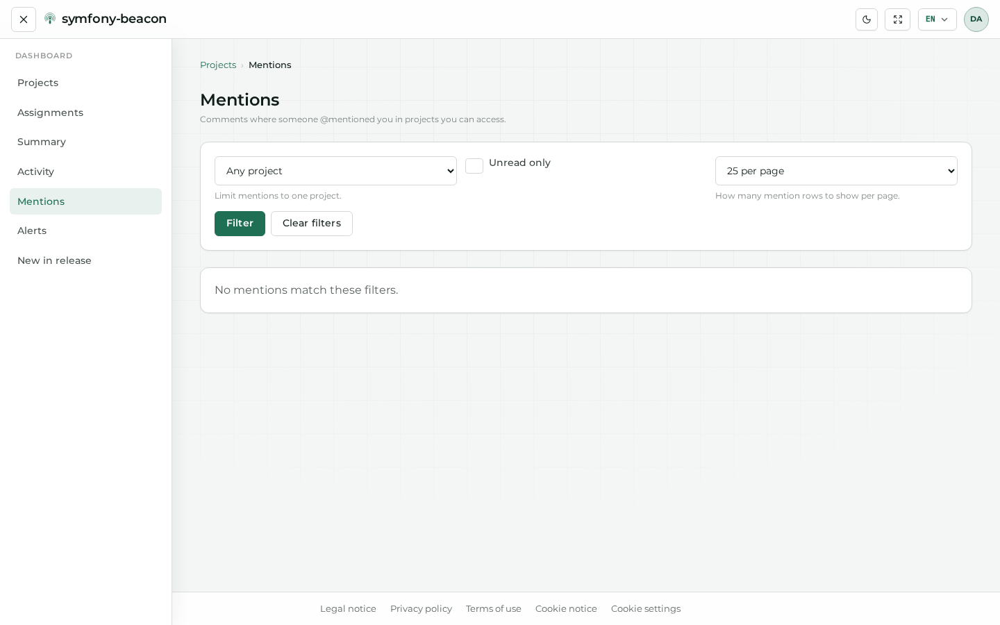
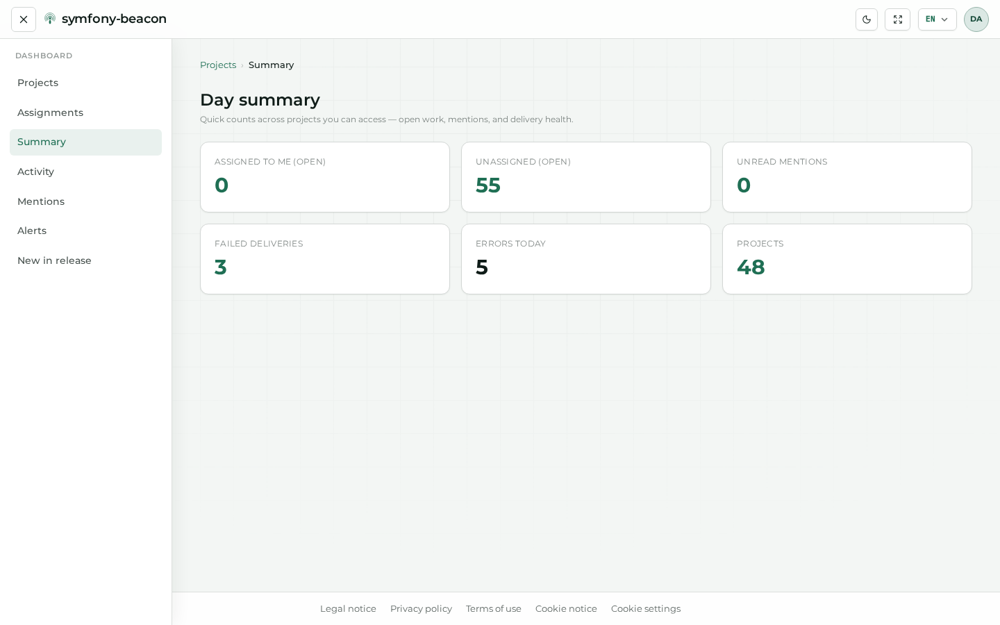
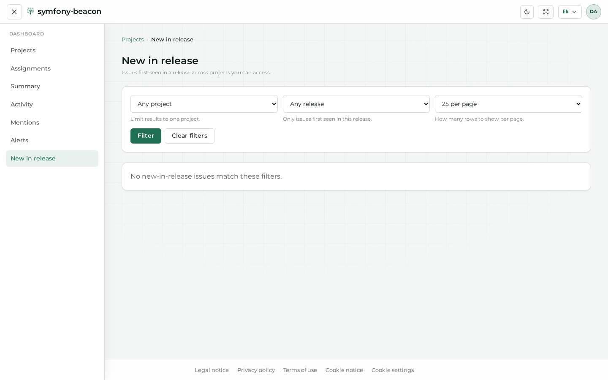
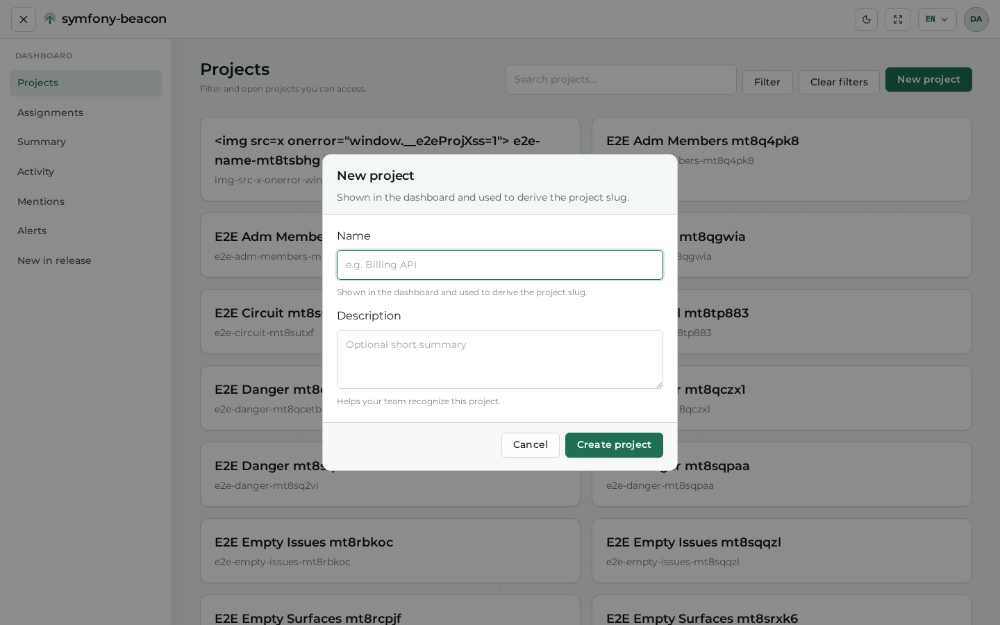

# Dashboard

The dashboard is the signed-in home: projects you can access, shortcuts, and cross-project panels.

## Projects home

Day/night comparison for this private surface: [Theme and language](07-appearance.md#private-example-dashboard).

## Panels

| Route | Purpose |
|-------|---------|
| `/dashboard/activity` | Recent activity |
| `/dashboard/alerts` | Alert feed |
| `/dashboard/assignments` | Issues assigned to you |
| `/dashboard/mentions` | Mentions |
| `/dashboard/summary` | Summary widgets |
| `/dashboard/new-in-release` | New issues in the release window |

## Create a project

## Next steps

- [Projects and issues](04-projects-and-issues.md)  
- [Account](03-account.md)  
