# Account

Profile, security, display preferences, and privacy tools (UserKit + AuthKit).

## Overview

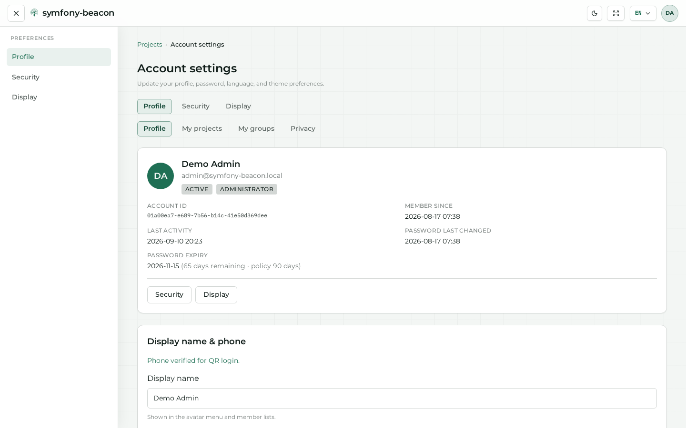

## Profile

## Projects and groups

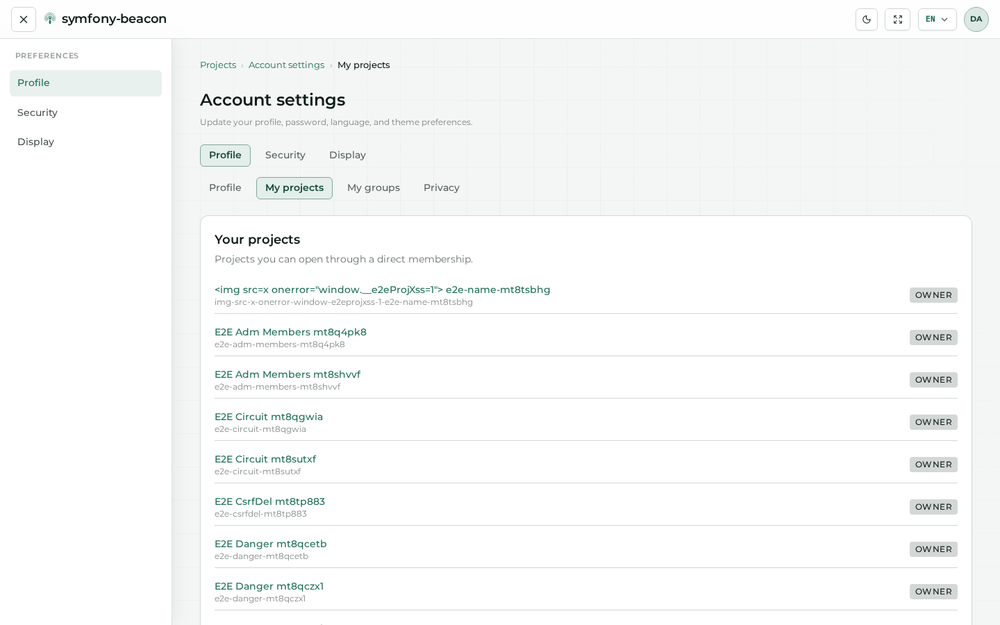

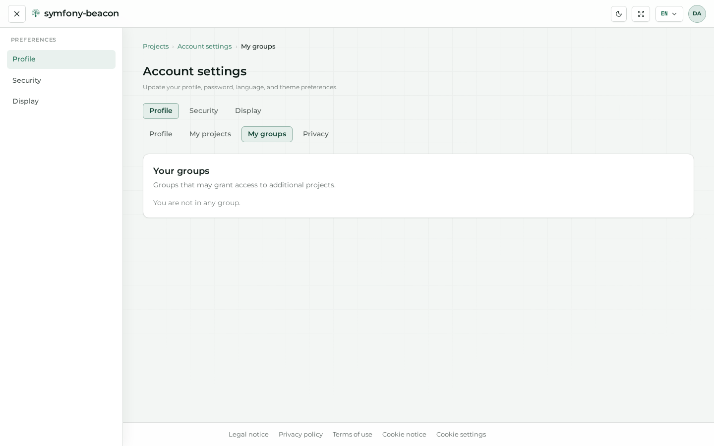

## Security

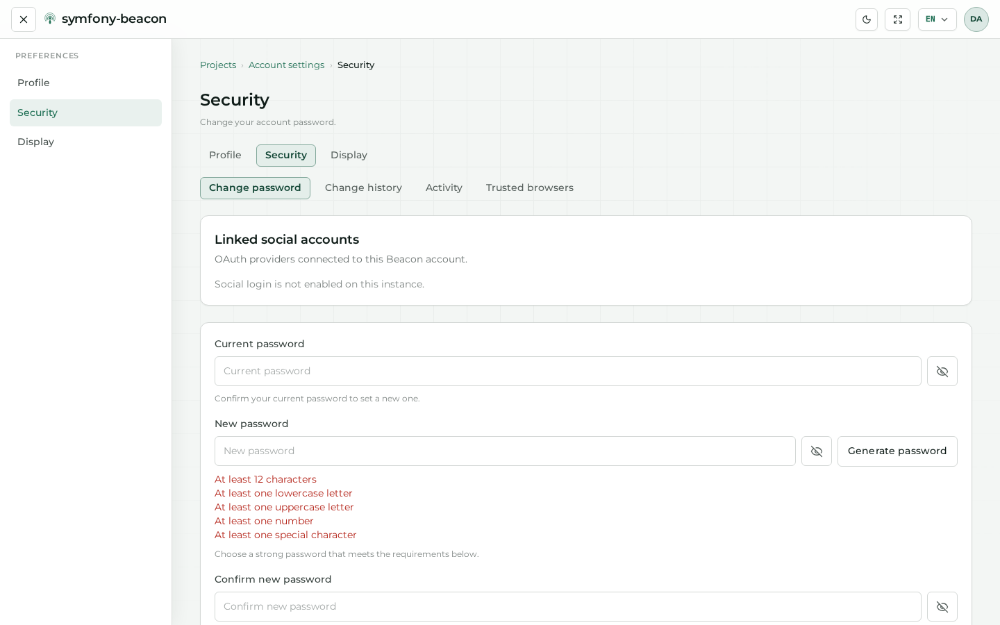

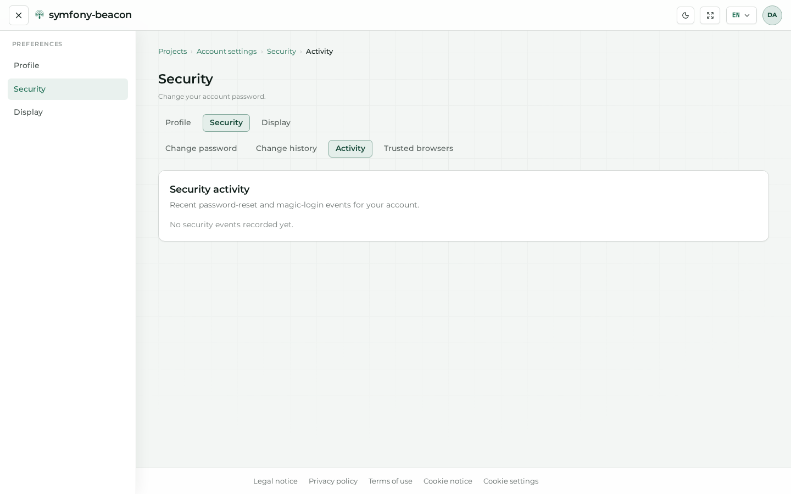

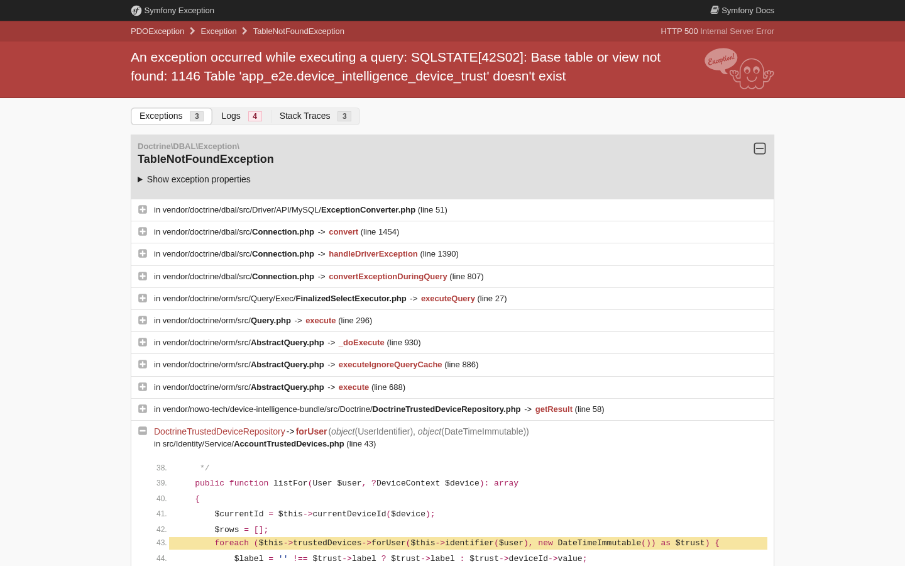

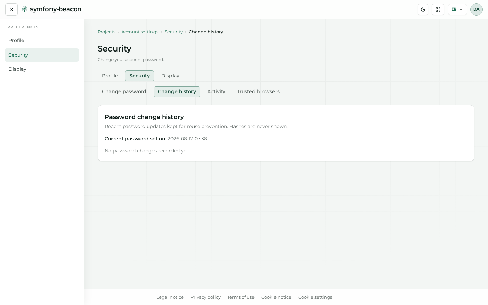

## Display

Theme defaults, panels, tours, and member notification display. Global day/night and language switching: [Theme and language](07-appearance.md).

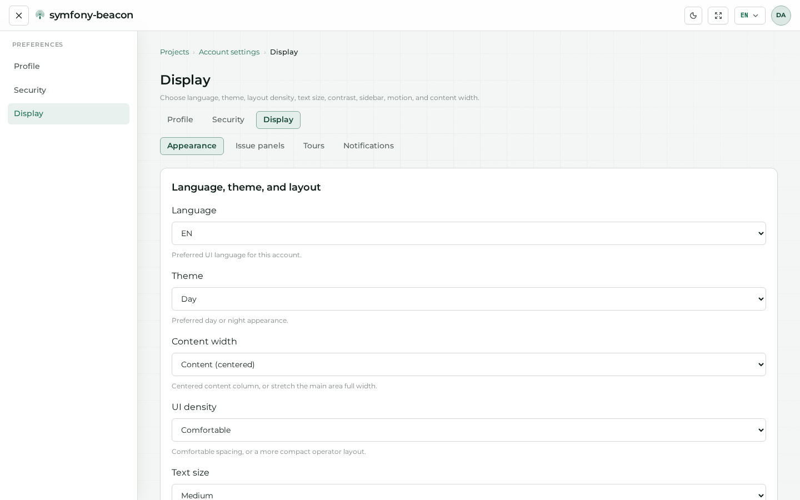

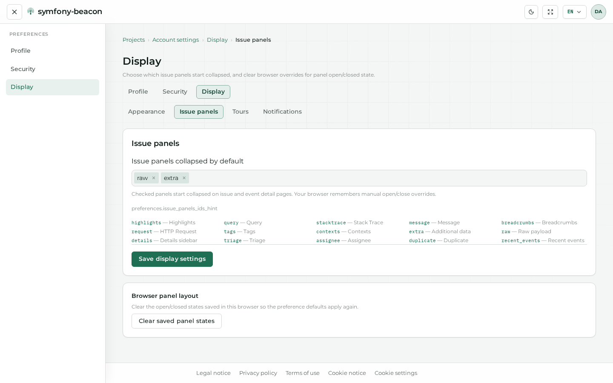

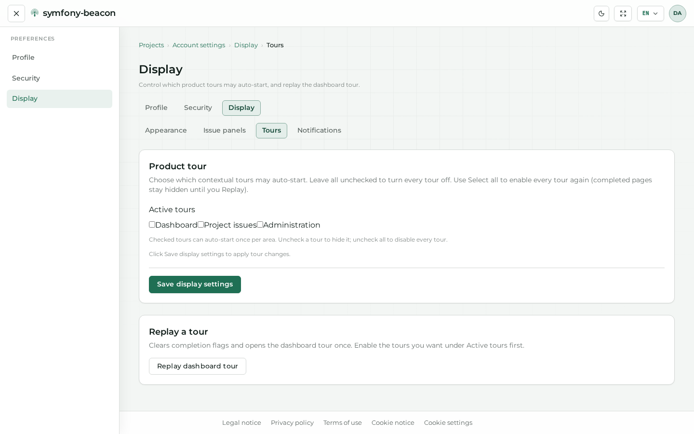

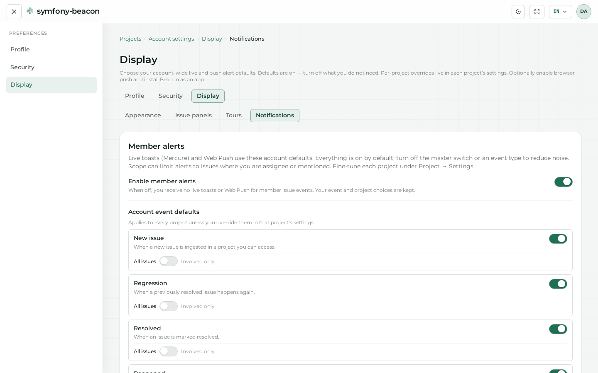

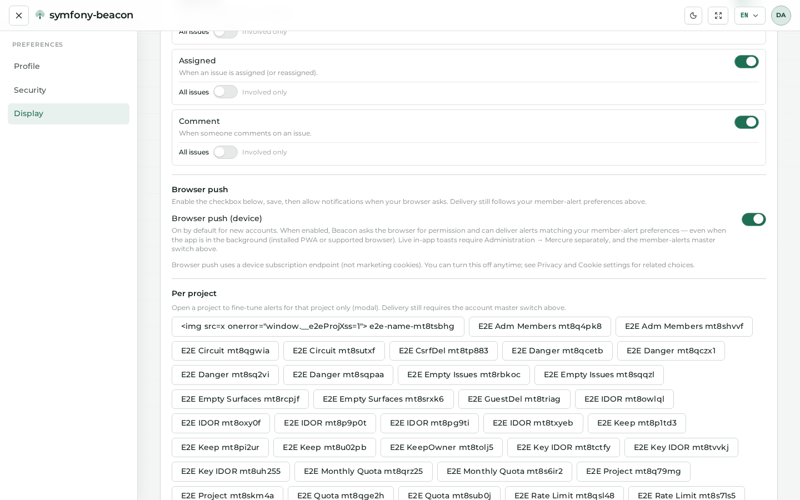

## Privacy

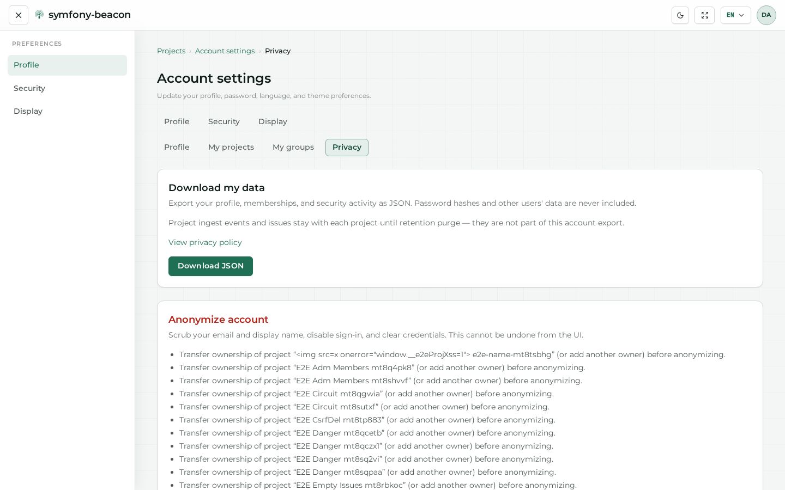

## Next steps

- [Projects and issues](04-projects-and-issues.md)  
- [Administration](05-admin-and-ops.md)  
