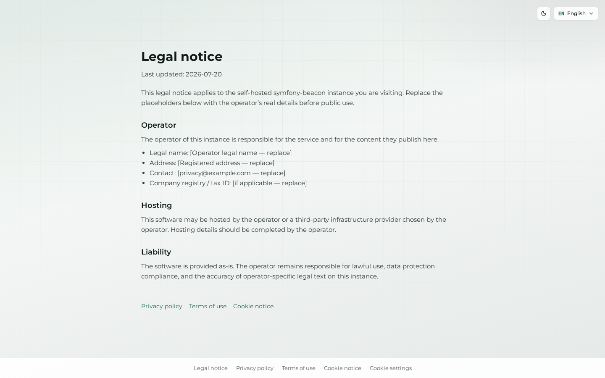
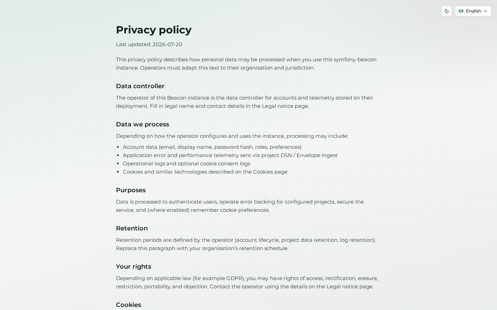
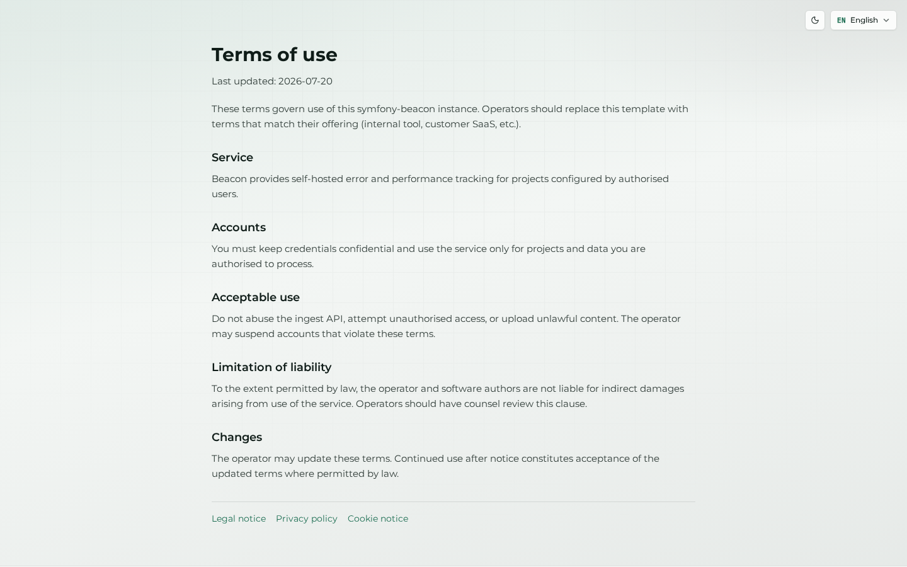
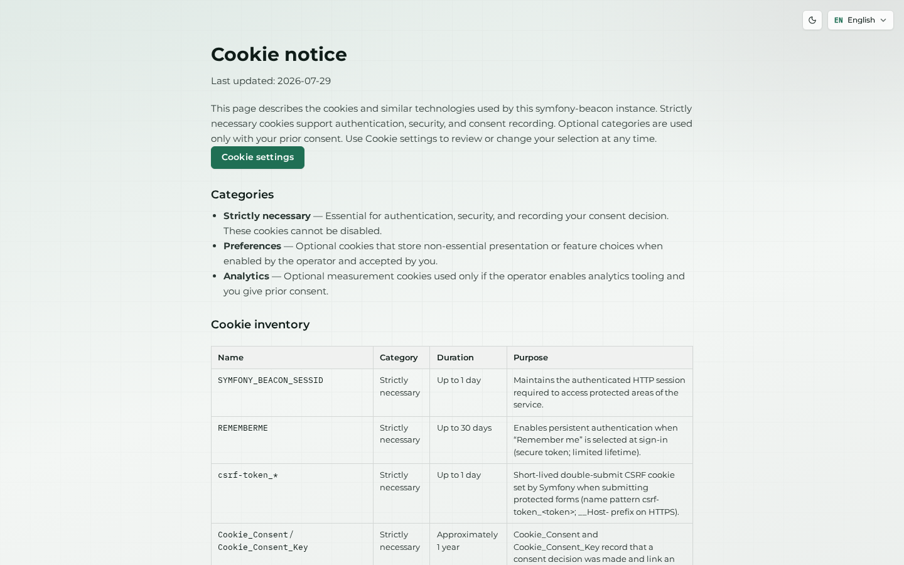

# Legal and privacy

Public legal pages ship as English UI copy (`lang="en"`) with room for operator-specific text. Cookie consent uses **`nowo-tech/cookie-consent-bundle`**. Do not add non-essential cookies or third-party scripts without consent UX.

Deep dive: [LEGAL-AND-COOKIES.md](../product/LEGAL-AND-COOKIES.md).

## Legal notice

## Privacy policy

## Terms of use

## Cookie policy

On AuthKit and related public routes, the consent modal may open automatically. Screenshots in this manual dismiss it for clarity; keep consent enabled whenever analytics or optional cookies are configured under Administration → Cookie consent.

## Account privacy tools

Signed-in users reach export / anonymize entry points from [Account → Privacy](03-account.md#privacy).
