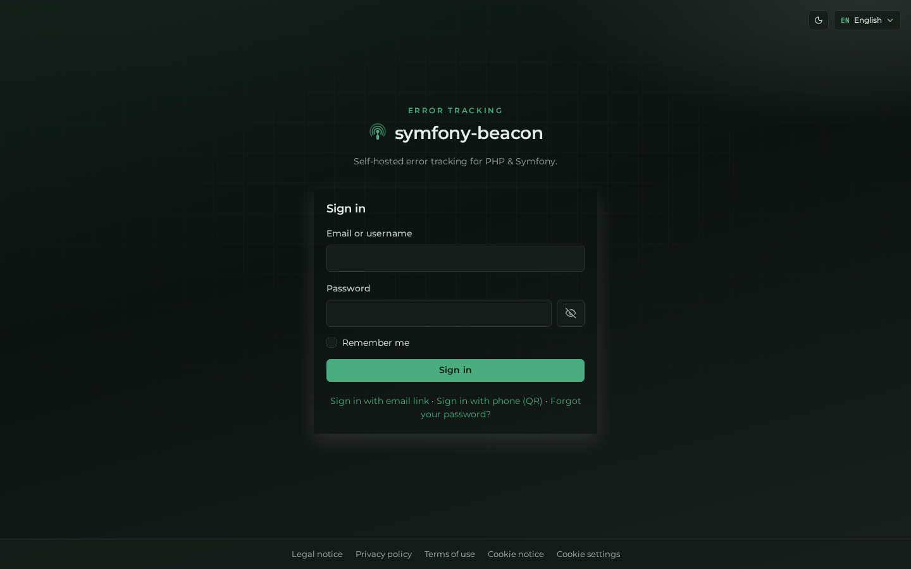
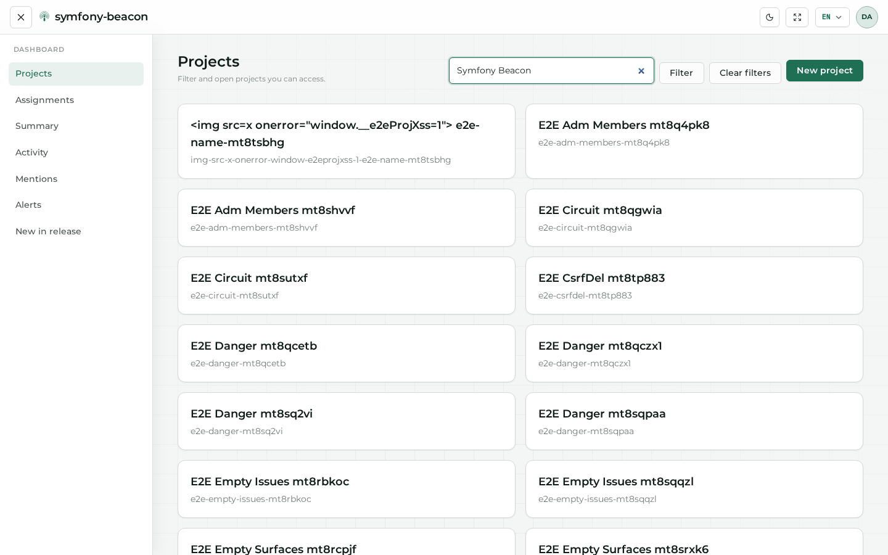
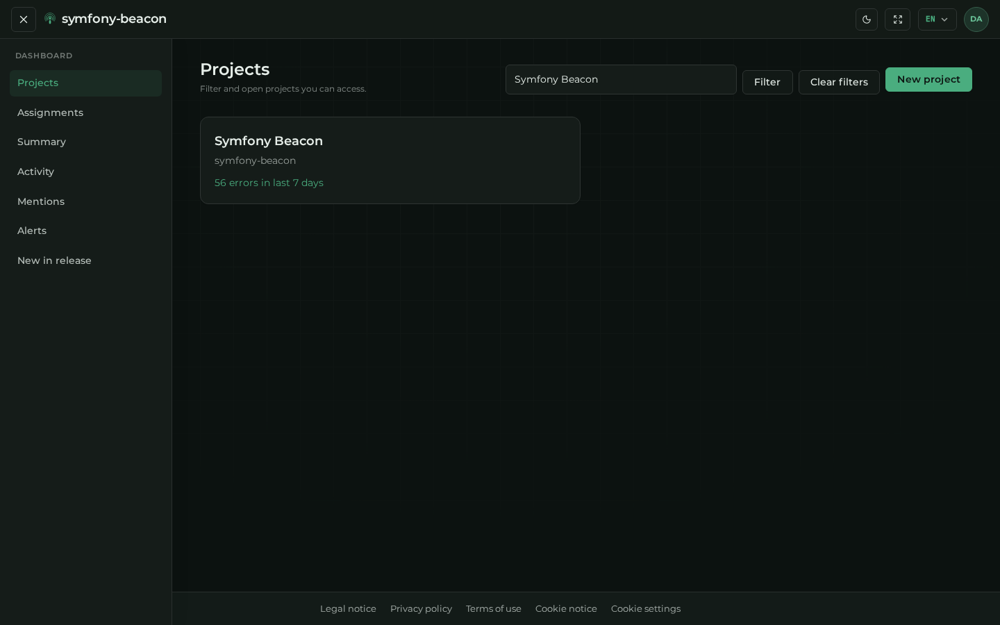
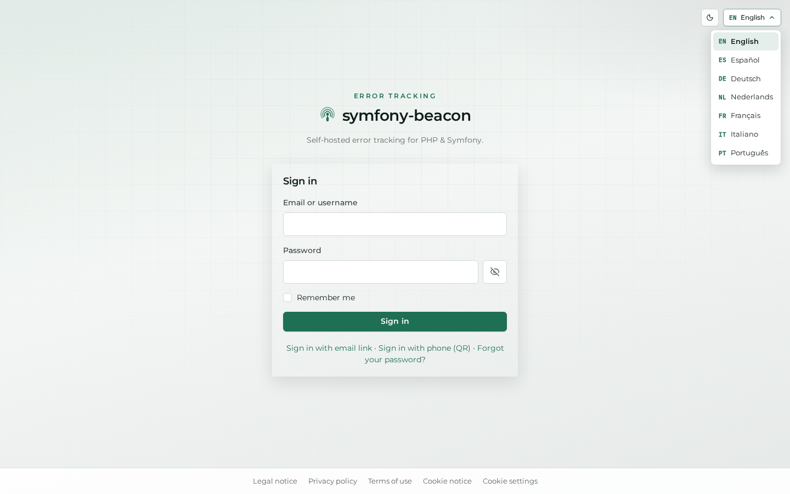
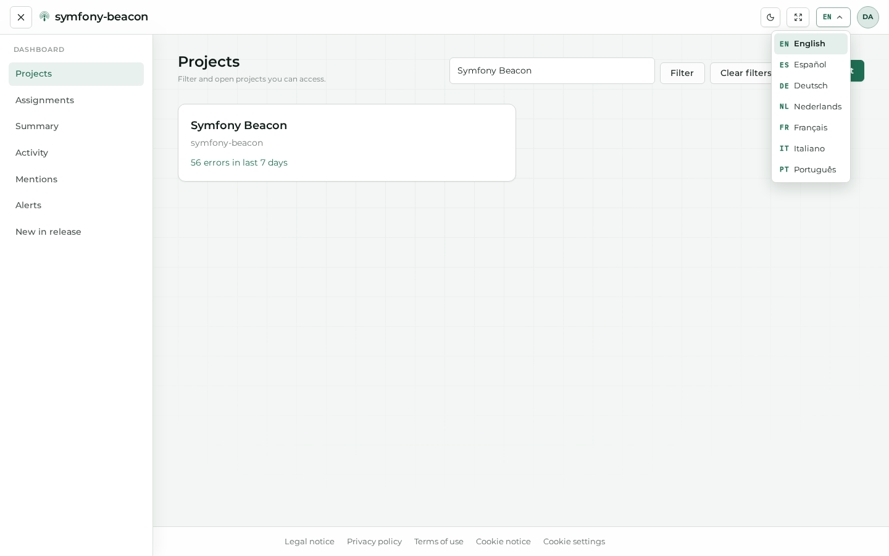

# Theme and language

Beacon lets each visitor (and each signed-in account) choose **day / night** theme and **UI language**. This chapter shows the controls once on a **public** page and once on a **private** page. The rest of the manual uses **English + day** at a fixed **1440×900** viewport so screenshots stay comparable.

## Theme (day / night)

### Where

The sun / moon control sits in the top bar (guest shell and authenticated chrome).

- Preference key: `localStorage` → `beacon-theme` (`light` | `dark`)
- Signed-in users may also sync a preferred theme on the account ([Account → Display](03-account.md#display))

### Public example (`/login`)

**What these shots contribute.** Same AuthKit sign-in surface in day vs night so operators see how branding and contrast behave for guests.

**Day**

**Night**

### Private example (`/dashboard`)

**What these shots contribute.** Confirms the toggle applies to authenticated chrome (sidebar, cards, headers), not only the public shell.

**Day**

**Night**

### How to change

1. Locate the theme toggle in the header (sun / moon icon).  
2. Click once to switch between day and night.  
3. The choice persists in the browser; signed-in accounts can keep it in sync with account display preferences.

Instance branding (colours, brand name) is separate: **[Administration → Appearance](05-admin-and-ops.md#appearance)**.

## Language

Enabled locales include `en`, `es`, `de`, `nl`, `fr`, `it`, `pt`. The default locale uses bare AuthKit paths (e.g. `/login`); other locales use prefixed paths where applicable. Legal pages use `/{locale}/legal/…` for every language.

### Public — open the language menu

**What it contributes.** Shows how guests switch locale from the AuthKit header before signing in.

### Private — open the language menu

**What it contributes.** Shows the same control inside the authenticated shell; the choice can be stored on the account.

### How to change

1. Open the **EN / language** control in the header.  
2. Choose a locale from the list.  
3. Guests: session locale (and path on dual public routes).  
4. Signed-in users: preference is stored on the account (`POST /account/locale/{locale}`).

This manual stays on **English** after the demos above so screenshots remain consistent.

## Related screens

- [Getting started — Sign in](01-getting-started.md)  
- [Account → Display](03-account.md#display)  
- [Administration → Appearance](05-admin-and-ops.md#appearance)  
