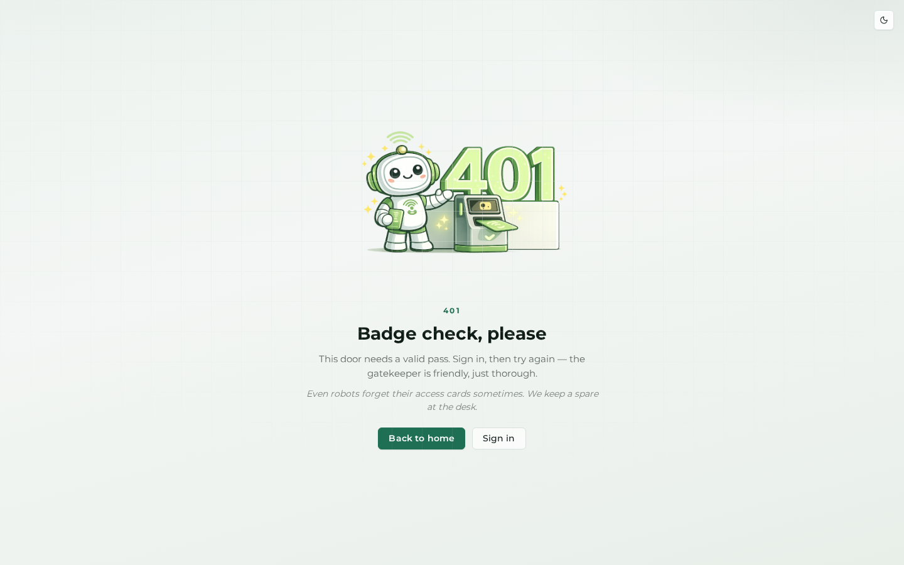
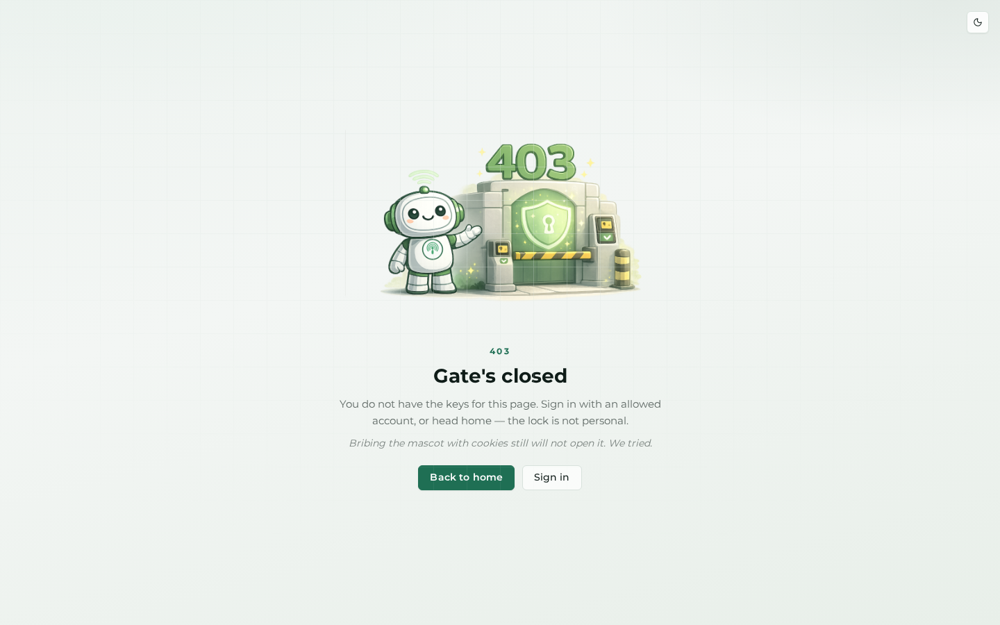
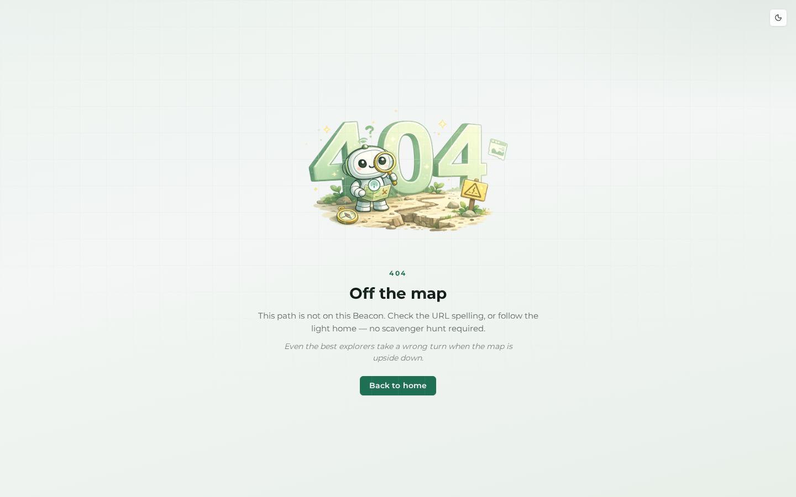
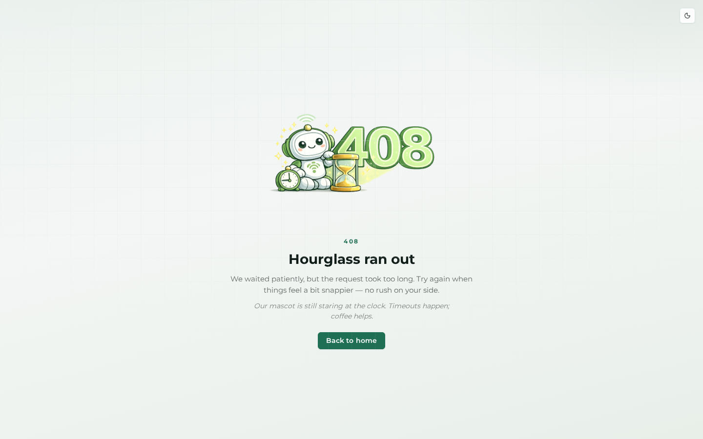
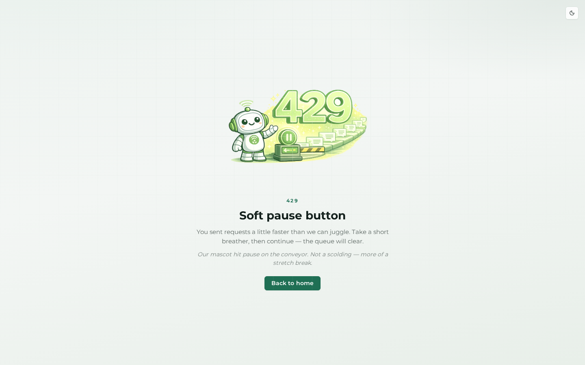
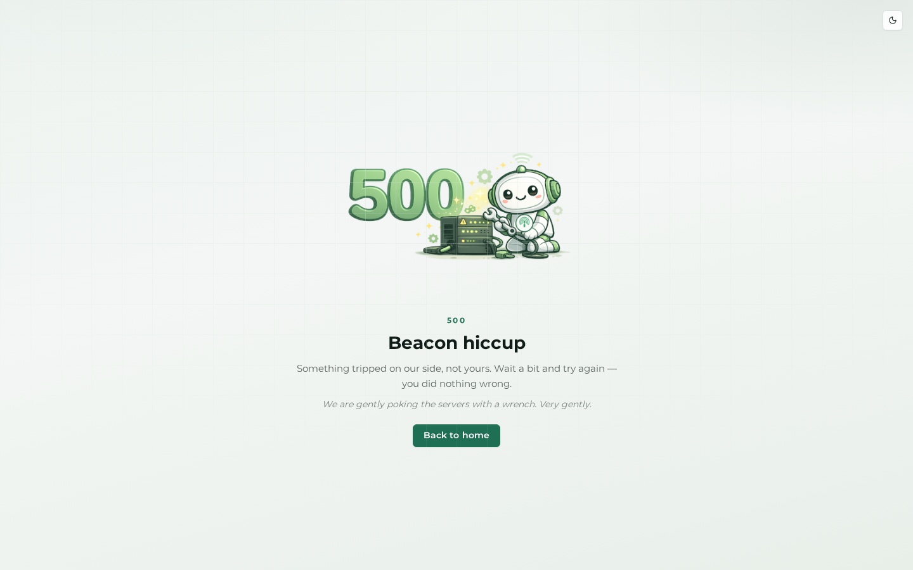
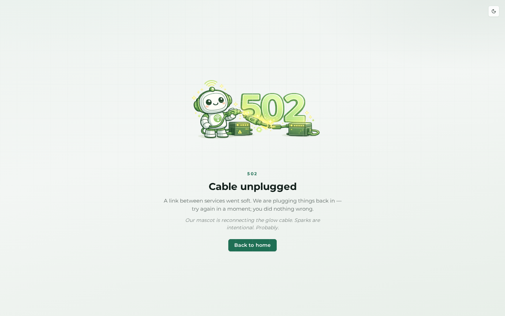
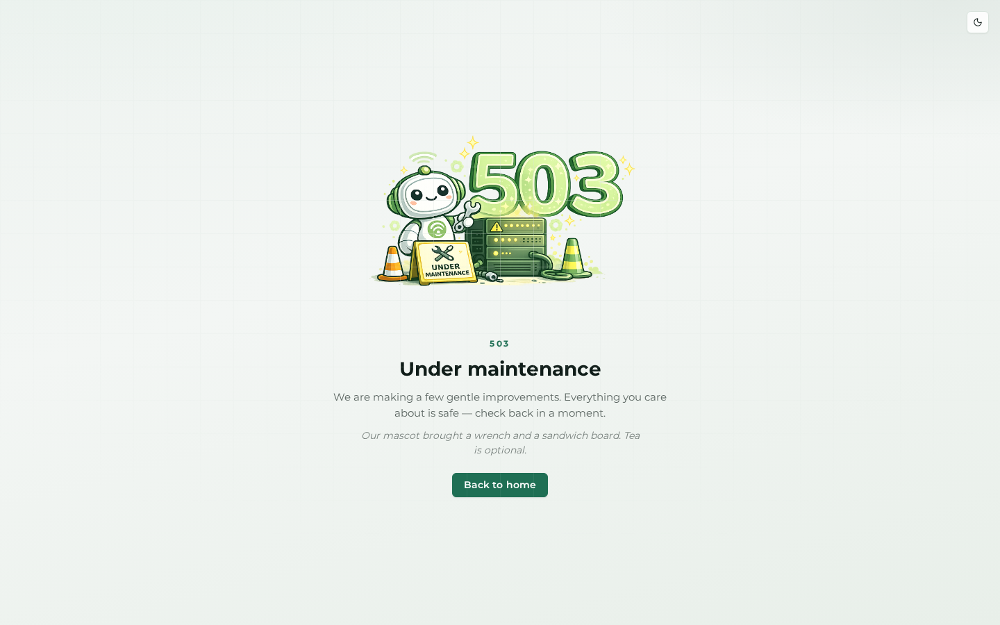

# Branded HTTP errors

This chapter documents the branded HTTP error pages used by Beacon when debug is off. Guests always see the light public error chrome with the product mascot illustration, never the authenticated dashboard shell. On the warm E2E stack these screenshots come from `/_error/{code}` in `APP_ENV=dev`; maintenance uses the same 503 artwork via `/_maintenance_preview`.

`/_error/{code}` is a development-only preview route (`when@dev`). In production, the same templates appear only during real failures or denied requests when debug is off.

## 400 — Bad request

Use this page when the request shape is invalid: malformed links, incomplete query strings, or input the application cannot interpret safely.

## 401 — Unauthorized

Use this page when the visitor must authenticate before continuing and the request cannot proceed as an anonymous guest.

## 403 — Forbidden

Use this page when the route exists but the current visitor does not have permission to use it.

## 404 — Not found

Use this page for missing routes or records that are no longer available. The mascot keeps the dead-end state friendly without exposing debug detail.

## 408 — Request timeout

Use this page when the browser or upstream request took too long and the application stopped waiting.

## 429 — Too many requests

Use this page when rate limiting protects the product from repeated or abusive traffic.

## 500 — Internal server error

Use this page for unexpected application failures once debug is disabled. Operators should still investigate logs and Beacon data; the public sees calm branded copy instead of a Symfony exception screen.

## 502 — Bad gateway

Use this page when an upstream dependency or proxy response is invalid before Beacon can finish the request cleanly.

## 503 — Service unavailable

Use this page when Beacon is temporarily unavailable because of maintenance or a short outage window.

## Maintenance preview

This preview uses the same 503 mascot artwork as the live maintenance response, but lets operators verify the public downtime page without enabling maintenance mode first.

